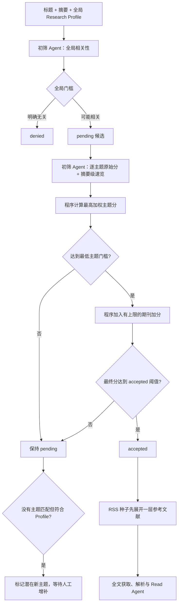

# `daily-paper-reader` 调研及 PaperRadar 建设路线建议

> 调研日期：2026-09-10  
> 本地方案基线：[`draft.md`](./draft.md)  
> 上游项目：[`ziwenhahaha/daily-paper-reader`](https://github.com/ziwenhahaha/daily-paper-reader)  
> 核对快照：[`80c591fd46f84495196ea5479f48e4ca6b6f3189`](https://github.com/ziwenhahaha/daily-paper-reader/tree/80c591fd46f84495196ea5479f48e4ca6b6f3189)

## 一、结论先行

三种建设路线中，建议选择：

> **方案 2：保持 PaperRadar 的独立架构和数据模型，选择性吸收 `daily-paper-reader` 的设计经验、行为契约、测试用例思路和极少量纯函数；不把它作为运行底座。**

这里的“方案 2”应作严格限定：

- PaperRadar 仍从自己的 `draft.md`、领域模型、SQLite Schema 和任务状态机开始实现；
- 优先提炼设计摘要并重新实现，不整模块搬运；
- 只有无外部状态、无 Supabase/GitHub/前端耦合的短小纯函数，经过适配成本评估后才考虑复制；
- 一旦复制实质性代码，保留来源、固定 commit，并履行 MIT License 的版权和许可声明要求；
- 不使用 Git submodule、git subtree 或 Fork 同步来维持运行关系。

不建议方案 3。两个项目虽然都叫“论文雷达/阅读器”，但真正重合的是产品表面流程，数据来源、身份模型、持久化方式、调度环境和最终交互均明显不同。在 `daily-paper-reader` 上删改成 PaperRadar，所需工作很可能大于建立自己的轻量底座，而且会长期承受上游快速演进带来的合并成本。

方案 1 也可行，但“完全从零、不参考成熟行为”会浪费上游已经踩过的坑。因此最合适的是：**工程主体采用方案 1 的独立建设方式，知识与少量实现复用采用方案 2；若必须只选一个编号，则选 2。**

## 二、调研方法与可信边界

本次不是只读 README，而是核对了以下内容：

- 项目 README、架构图、教程和默认配置；
- Python 主流水线、Profile 编译、BM25/Embedding/RRF/Rerank、LLM refine、全文和报告生成；
- Supabase Schema/RPC、GitHub Actions、前端管理与阅读模块；
- 代表性测试，包括 Profile、状态合并、结构化输出、全文异常、缓存失效和路径安全；
- MIT License 与依赖清单。

该快照约有 407 个受版本控制文件。对核心 `src`、`app/*.js`、`tests`、`sql` 和 workflows 粗略统计约 6.8 万行；其中存在多个 1,000～3,500 行的单文件模块，说明它已经是完整应用，而不是可插拔的小型 Python 库。

本地环境没有安装 `pytest`，因此未安装上游依赖、也未声称测试已在本机通过；`python3 -m compileall -q src tests` 通过。上游有约 376 个 Python 测试函数和约 260 个 JavaScript 测试调用，并在一个按路径触发的 workflow 中运行 Python/JavaScript 回归测试；可参考其[测试 workflow](https://github.com/ziwenhahaha/daily-paper-reader/blob/80c591fd46f84495196ea5479f48e4ca6b6f3189/.github/workflows/cloud-model-check.yml)。

## 三、两个系统究竟有多相似

|维度|PaperRadar `draft.md`|`daily-paper-reader`|判断|
|---|---|---|---|
|核心目标|个人长期掌控的发现、身份解析、筛选、全文精读和积累系统|Fork 即用的 AI 论文推荐与网页阅读站|目标邻近，但侧重点不同|
|日常发现|期刊 RSS/RSSHub；accepted RSS 论文回溯一层参考文献|维护 arXiv、预印本和会议语料库，再主动检索|输入模型不同|
|召回|不建立语料检索层|BM25 + Embedding + RRF + Reranker + LLM refine|本次已明确不移植|
|论文身份|内部 UUID；DOI/OpenAlex/arXiv/PMID 等多锚点合并|主要依赖各来源 paper ID，尤其是 arXiv ID|不能直接复用数据模型|
|持久化|本机 SQLite + 内容寻址附件 + NAS 备份|Supabase 论文库 + Git 中的 JSON/Markdown/状态文件|基础设施相反|
|调度|用户级 systemd timer，短任务、断点续跑|GitHub Actions 定时/手动触发，顺序执行编号脚本|不可直接复用编排|
|中间状态|数据库状态机、短事务、单篇失败隔离|日期目录下的 JSON 文件，经环境变量和路径串联|PaperRadar 的方案更适合长期事实库|
|筛选|语义初筛后进入 accepted/pending/denied|多路召回、重排、LLM 0～10 分，再分速览/精读|可借鉴分层思想，不应复制算法栈|
|全文|Unpaywall/人工补充；永久保存原 PDF；版本化解析制品|主要面向可直接取得 PDF 的来源；Jina Reader 优先、PyMuPDF 回退|PaperRadar 的可追溯性要求更高|
|阅读结果|结构化 `analyses` 历史、标签、Rank|生成 Markdown、日报、侧边栏与网页阅读内容|后期报告投影可借鉴|
|交互|第一版 CLI，后期 Markdown 报告|Docsify 网页、AI 问答、未读同步、Zotero、Gist|本次只选取很小子集|

上游 README 将自己定位为 GitHub Actions + GitHub Pages 的“零服务器、Fork-and-Run”系统，参见[项目说明](https://github.com/ziwenhahaha/daily-paper-reader/blob/80c591fd46f84495196ea5479f48e4ca6b6f3189/README.md#why-daily-paper-reader)和[主 workflow](https://github.com/ziwenhahaha/daily-paper-reader/blob/80c591fd46f84495196ea5479f48e4ca6b6f3189/.github/workflows/daily-paper-reader.yml)。这正是它易于公开展示的原因，也是它不适合作为本机 SQLite 长期知识库底座的原因。

## 四、功能调研后的逐项确认结果

### 4.1 已吸收或调整后吸收

|候选能力|最终决定|对 `draft.md` 的影响|
|---|---|---|
|速览/精读分层|吸收，但映射到现有状态|`pending` 生成摘要级轻量速览；`accepted` 保持全文精读|
|多个 Intent Profile|调整后吸收|采用“一份全局 Research Profile + 多个轻量关注主题”，不照搬检索关键词结构|
|Profile 外发现|必须保留|未命中任何主题但符合全局 Profile 的论文留在 `pending`，提示潜在新主题|
|确定性分数计算|吸收|Agent 只给原始语义分；程序应用主题权重、主题门槛、期刊加分和最终阈值|
|Markdown 日报与单篇报告|吸收，但排在实现后期|数据库仍是真实来源；Markdown 只是可重建的读取投影|
|`carryover`|部分吸收|只结转尚未 `delivered` 的 `analyzed` 论文，展示窗口为 3 天|
|输入指纹缓存|吸收工程思想|按输入内容、模型、提示词、Profile/主题版本决定是否复用，不缓存失败结果|
|重复运行时合并报告|吸收工程思想|报告重建不得重复条目，不得覆盖用户笔记|

### 4.2 明确不进入第一版

|候选能力|决定|原因|
|---|---|---|
|主动语料检索|不加入|保持 RSS + accepted RSS 论文的一层参考文献回溯|
|BM25/Embedding/RRF/Reranker|不加入|没有主动语料检索后，这套基础设施没有必要|
|历史时间窗补抓|不加入|从启用当天开始；历史只由一层参考文献进入|
|论文多轮 AI 对话|不加入|维持“初筛 Agent + Read Agent”两个 Agent 的边界|
|Zotero 集成|不加入|PaperRadar 自己管理论文、附件、标签和分析|
|图表提取和多模态精读|不加入|第一版只保留原始 PDF和版本化 Markdown/纯文本|
|静态网页管理后台|不加入早期阶段|先完成可靠数据和 CLI；Markdown 报告排在后期|
|`pending` 跨日报结转|不加入|`pending` 仅首次出现在日报，但长期保留在数据库待复核队列|

### 4.3 三处需要固定语义

1. `pending` 不再只是“什么都没做的中间状态”。它拥有摘要级轻量结果，但没有全文分析。
2. `analyses` 仍只保存基于完整全文产生的 Read Agent 结果。不得把标题/摘要推断写成全文结论。
3. `carryover` 只是报告查询规则，不创建论文副本、不改变 `discovered_at`，也不重新执行任何模型调用。

关于“展示 3 天”，建议实现时固定为“首次进入日报当天算第 1 天，共出现在 3 份日历日报中”；如果希望表达“首次当天之后再结转 3 天”，应在修改 `draft.md` 时显式改成 4 份日报，避免 off-by-one。

## 五、修订后的第一版筛选模型

### 5.1 推荐状态流



全局 Profile 是开放式安全网；轻量主题是自动晋级条件，而不是全局淘汰条件。这样既可以稳定自动接收已知兴趣，也不会让尚未建主题的新方向直接消失。

### 5.2 确定性计算骨架

对主题 `i`：

```text
raw_topic_score_i = Agent 输出的 0～100 原始相关性分
topic_weight_i    = 用户在主题配置中定义的权重
weighted_i        = raw_topic_score_i × topic_weight_i

topic_score = max(weighted_i)
```

随后执行：

```text
if topic_score < minimum_topic_gate:
    status = pending
else:
    final_screening_score = min(100, topic_score + journal_bonus)
    status = accepted if final_screening_score >= accept_threshold else pending
```

约束如下：

- `journal_bonus` 必须有上限；
- 期刊加分只能在达到最低主题门槛后生效；
- 高期刊分不能单独把论文推进 `accepted`；
- 全局 Profile 的判断负责 `denied`/候选 `pending` 门控，当前确认中不直接混入主题最终分；
- 所有公式由纯函数执行，LLM 不读取期刊分，也不决定权重和最终状态；
- 主题权重、门槛、期刊加分和公式均需版本化；改变配置后先 dry-run，再显式重算。

尚未确认、不得在实现时暗自决定的数值包括：全局拒绝阈值、主题权重范围、最低主题门槛、期刊分到 bonus 的映射、bonus 上限和 accepted 阈值。这些应在正式改写 `draft.md` 时给出启动值。

### 5.3 Profile 与轻量主题建议 Schema

全局 Profile 继续保持自由文本，并建议在内容中使用明确章节：个人研究背景、核心问题、可迁移方法、关注场景、排除项和探索边界。

轻量主题放入单独的版本化配置，例如：

```yaml
version: topics-v1
topics:
  - id: tropical-cyclone-intensity
    name: 台风强度变化
    description: 关注台风快速增强、强度预报及相关物理机制
    weight: 1.0
    enabled: true
```

轻量主题不需要 `daily-paper-reader` 的 `keywords`、embedding query 或 `paper_sources`。该项目的 Profile 本质上是检索计划：每项含 `tag`、`description`、关键词、语义查询和数据源，并被编译成 BM25/Embedding 输入，参见[示例配置](https://github.com/ziwenhahaha/daily-paper-reader/blob/80c591fd46f84495196ea5479f48e4ca6b6f3189/docs_init/config.yaml#L28-L78)和[`build_pipeline_inputs`](https://github.com/ziwenhahaha/daily-paper-reader/blob/80c591fd46f84495196ea5479f48e4ca6b6f3189/src/subscription_plan.py#L313-L536)。PaperRadar 不建立这类检索层，因此只吸收“多个主题、独立启停、稳定 ID、显式版本”的部分。

### 5.4 初筛输出建议

仍然只有一个 Screening Agent，但分成两个明确调用阶段和两个 Schema：

```python
class GlobalScreeningOutput(BaseModel):
    relevance_score: int = Field(ge=0, le=100)
    relevance_reason: str


class TopicMatchOutput(BaseModel):
    topic_id: str
    relevance_score: int = Field(ge=0, le=100)
    reason: str


class PendingBriefOutput(BaseModel):
    abstract_takeaway: str
    why_relevant_to_me: str
    review_reason: str
    topic_matches: list[TopicMatchOutput]
```

第二阶段只对通过全局门槛的论文调用。主题 ID 必须来自程序提供的允许集合；若模型遗漏、重复或生成未知 ID，Schema/业务验证失败并有限重试。

`PendingBriefOutput` 不应声称读过全文。字段名称和提示词应使用“摘要显示”“基于摘要判断”等明确措辞。

### 5.5 数据模型影响

原稿把当前初筛结果直接放在 `papers`，旧结果只进审计日志。加入多主题原始分、可重算公式和摘要级速览后，建议新增 append-only 的 `screening_assessments` 表，而不是继续扩张 `papers` 或把所有内容塞进日志：

|字段组|建议字段|
|---|---|
|身份|`id`、`paper_id`、`stage`（`global`/`topics`）|
|Agent 原始输出|`relevance_score`、`reason`、`topic_scores_json`、轻量速览字段|
|复现上下文|provider、model、prompt version/hash、Profile version/hash、topics version/hash|
|程序计算|`matched_topic_id`、`topic_score`、`journal_score_snapshot`、`journal_bonus`、`final_screening_score`、`scoring_version`|
|结论|`decision`、`created_at`、`success`、错误摘要|

`papers` 只镜像列表查询需要的当前字段和最新 assessment ID。这样改变主题权重或期刊配置时，可以复用历史 Agent 原始分重新计算，不必重新调用模型；同时仍与全文 `analyses` 保持严格分离。

期刊评分建议使用 ISSN/ISSN-L 作为配置键，期刊名只作为展示字段，避免别名和改名造成错误匹配。若无法可靠解析到期刊评分，结果应为“缺失”，而不是暗中按零分处理。

## 六、值得借鉴的工程设计

### 6.1 Profile 配置到运行计划的编译边界

上游没有让 BM25、向量检索和 LLM 各自解释配置，而是由 `subscription_plan.py` 统一规范化 Profile，再产出各阶段的输入。这一思想值得直接吸收：

```text
版本化用户配置 → 校验/规范化 → 不可变 RuntimePlan → 各任务消费
```

PaperRadar 可实现：

- `profiles/compiler.py`：读取全局 Profile 和 topics，校验稳定 ID、权重和版本；
- `screening/decision.py`：纯函数计算主题分、期刊 bonus 和状态；
- 任务层只消费编译后的对象，不直接读取散落 YAML 字段。

不要复制上游整个 `subscription_plan.py`，因为它的大部分字段和分支都服务 BM25/Embedding、多来源路由和配置迁移。

### 6.2 输入指纹和“成功结果才缓存”

上游的长时间窗阅读流程会把调用类型、输入内容、模型和服务地址组成 SHA-256 指纹；只有非空且完整的结果才原子写入缓存，见[`cache_reading_generators`](https://github.com/ziwenhahaha/daily-paper-reader/blob/80c591fd46f84495196ea5479f48e4ca6b6f3189/src/long_range_native.py#L21-L73)。

PaperRadar 应将这一思想推广到：

- 元数据请求缓存：来源 + 规范身份 + 请求版本；
- 初筛：标题、摘要、Profile hash、topics hash、模型和提示词；
- PDF 解析：PDF SHA-256 + parser/version/config hash；
- Read Agent：解析制品 hash + Profile hash + model + prompt hash；
- Markdown 投影：数据库结果版本 + 模板版本。

不要照搬装饰器式 monkey patch；应实现显式 `Fingerprint` 值对象和 repository/service API。

### 6.3 原子写入和可重建投影

上游 `save_daily_state()` 使用同目录临时文件、`flush`、`fsync`、`os.replace`，并在重复运行时按论文身份合并日报状态，见[`daily_report_state.py`](https://github.com/ziwenhahaha/daily-paper-reader/blob/80c591fd46f84495196ea5479f48e4ca6b6f3189/src/daily_report_state.py#L11-L113)。这与 `draft.md` 中附件清单的提交纪律一致。

应进一步明确：

- SQLite 是事实源；日报、单篇 Markdown、索引 JSON 都是投影；
- 生成任务先在临时目录完成并校验，再原子替换；
- 重建报告不更新论文业务状态；
- 报告中的自动区块与用户笔记必须分区，生成器只能替换带稳定 marker 的自动区块；
- 报告可从数据库全部重建，不依赖解析旧 Sidebar HTML 来恢复事实。

### 6.4 分阶段追踪能力

上游 `main.py` 支持指定 arXiv ID，逐阶段打印是否进入 raw、召回、重排、LLM 和推荐结果，见[`main.py`](https://github.com/ziwenhahaha/daily-paper-reader/blob/80c591fd46f84495196ea5479f48e4ca6b6f3189/src/main.py#L507-L725)。

PaperRadar 很适合增加：

```bash
paper-radar trace <paper-id>
```

它应从数据库审计记录聚合显示：发现来源、身份匹配、元数据来源、全局筛选、主题分、期刊加分、参考文献展开、全文、解析、分析和 Rank。该能力对调试“为什么没进入下一步”很有价值，且比翻日志更稳定。

### 6.5 结构化输出的兼容降级

上游 `LLMClient` 会按供应商能力在 `json_schema → json_object → prompt_only` 间降级，并验证返回结构，见[`llm.py`](https://github.com/ziwenhahaha/daily-paper-reader/blob/80c591fd46f84495196ea5479f48e4ca6b6f3189/src/llm.py#L279-L489)和[`chat_structured`](https://github.com/ziwenhahaha/daily-paper-reader/blob/80c591fd46f84495196ea5479f48e4ca6b6f3189/src/llm.py#L693-L764)。

可借鉴“能力协商、错误分类、有限降级”的行为，但不建议复制该客户端：

- 它实际只支持 DeepSeek，而 `draft.md` 要求多供应商；
- 它用可变 `kwargs` 和类级 token 计数，增加并发推理负担；
- 自动补齐截断 JSON 的括号可能把不完整语义包装成语法合法结果；
- PydanticAI + Pydantic 模型更符合现有方案。

PaperRadar 应在 PydanticAI 外层补充供应商能力表和错误分类，但最终仍必须通过完整 Pydantic/业务验证；不能把修复 JSON 语法当成输出成功。

### 6.6 每篇任务隔离和有界并发

上游曾因共享 LLM client 的可变参数出现并发问题，后改为每篇论文独立 client。这个教训值得吸收，但不必机械地“每篇新建所有连接”。推荐边界是：

- HTTP transport 可安全复用连接池；
- 每次 LLM 调用的请求参数必须是不可变局部对象；
- 不使用类级可变统计状态；
- 任务以 paper ID 作为隔离单元；
- 并发数按供应商和 SQLite 写入能力分别限制；
- 外部调用期间不持有数据库写事务。

### 6.7 回归测试中的行为契约

上游测试中最值得转化为 PaperRadar 用例的不是具体 UI，而是这些事故模型：

- 空或错误的全文缓存必须失效，不能当成成功结果；
- HTML、撤稿通知、访问拒绝页不能冒充 PDF/全文；
- 缺少完整模型输出时不得发布占位“精读结果”；
- 相同输入复用缓存，标题/摘要/模型/提示词变化使缓存失效；
- 报告重跑保留用户笔记；
- 路由和文件名拒绝 `../` 等目录穿越；
- 同日多次运行按论文身份合并，分数采用明确规则，标签去重；
- “格式降级”和“模型内容无效”是两类不同错误。

相关例子见[`test_paper_fulltext.py`](https://github.com/ziwenhahaha/daily-paper-reader/blob/80c591fd46f84495196ea5479f48e4ca6b6f3189/tests/test_paper_fulltext.py)、[`test_reading_content.py`](https://github.com/ziwenhahaha/daily-paper-reader/blob/80c591fd46f84495196ea5479f48e4ca6b6f3189/tests/test_reading_content.py)和[`test_daily_report_state.py`](https://github.com/ziwenhahaha/daily-paper-reader/blob/80c591fd46f84495196ea5479f48e4ca6b6f3189/tests/test_daily_report_state.py)。应按 PaperRadar 的领域模型重写测试，不要复制其临时目录结构和 Markdown 契约。

## 七、不建议借鉴或直接搬运的部分

### 7.1 GitHub Actions + Git 提交充当运行和状态总线

上游主流程通过 `subprocess.run(check=True)` 顺序调用编号脚本，以 `DPR_RUN_DATE` 和日期目录中的 JSON 隐式衔接，再把 docs/archive commit 回仓库。它很适合零服务器展示，但与 PaperRadar 的要求冲突：

- 任一步失败会中断整条批次，而 PaperRadar 要求单篇失败隔离；
- 文件是中间状态和部分事实源，跨任务事务能力弱；
- Git push/rebase 冲突成为业务运行问题；
- 本机附件、人工补 PDF、SQLite 快照和 NAS 备份难以自然接入。

因此保留 `draft.md` 的 systemd + 数据库任务选择器，不引入编号脚本编排。

### 7.2 Supabase 与多源检索 Schema

上游使用 pgvector、PostgreSQL FTS、HNSW/精确余弦 RPC，并存在多张来源表及相似 SQL。参见[通用论文表](https://github.com/ziwenhahaha/daily-paper-reader/blob/80c591fd46f84495196ea5479f48e4ca6b6f3189/sql/create_papers_schema.sql)和[arXiv RPC](https://github.com/ziwenhahaha/daily-paper-reader/blob/80c591fd46f84495196ea5479f48e4ca6b6f3189/sql/match_arxiv_papers.sql)。

本次已明确第一版不主动检索，移植这部分只会引入数据库服务、向量维度、模型维护和数据同步成本。PaperRadar 的统一 `papers` 表、多身份锚点和 provider adapters 更合适。

#### PaperRadar 的数据库演进方式

第一版以“本地 SQLite 为唯一事实源 + 本地附件仓库 + NAS 备份”为准，不让 SQLite 和 Supabase 双写，也不为尚未确定的远程访问需求同时维护两套数据库。双写需要额外解决权威数据归属、网络失败补偿、状态冲突、分析历史去重以及数据库与附件的一致性恢复，明显超出第一版范围。

在不增加双数据库复杂度的前提下，代码保留有限、务实的 PostgreSQL/Supabase 迁移余地：

- 将 SQLModel 表模型、业务状态机与任务编排分离；
- 通过配置创建数据库连接，不在业务代码中散布 SQLite 文件路径；
- 将事务和查询集中在 repository/service 层，外部 API 与 LLM 调用不持有数据库事务；
- Schema 始终通过 Alembic 迁移演进；
- 避免把 SQLite 专用 SQL、PRAGMA 或 upsert 语法渗透到领域逻辑；
- UUID、UTC 时间、枚举和 JSON 字段选择可清晰映射到 PostgreSQL 的表示，并在数据库约束与应用类型之间保持一致；
- Markdown 日报、单篇报告和索引 JSON 继续作为可由数据库完整重建的投影，不成为第二事实源。

这里的目标不是从第一天同时兼容 SQLite 和 PostgreSQL，而是避免无意中把核心业务锁死在 SQLite 方言上。只有当系统实际出现多机器/多用户直接共享、Web 或移动端认证授权、大规模全文/向量检索，或多个 worker 的持续并发写入成为真实瓶颈时，再启动一次性迁移评估：只需要并发数据库时优先考虑普通 PostgreSQL；同时需要 Auth、自动 API、RLS、Realtime 或对象存储时再选择 Supabase。

### 7.3 Jina Reader 优先的全文链路

上游把 PDF URL 发给 `r.jina.ai` 获取 Markdown，失败后才下载 PDF 并用 PyMuPDF 提取，见[`fetch_paper_markdown_via_jina`](https://github.com/ziwenhahaha/daily-paper-reader/blob/80c591fd46f84495196ea5479f48e4ca6b6f3189/src/6.generate_docs.py#L177-L208)。不建议照搬，因为：

- 多一个外部可用性和隐私边界；
- 返回的 Markdown 不等于已验证、已归档的原 PDF；
- 难以满足 parser version、PDF hash 和解析制品 hash 的复现要求。

第一版继续采用“先取得并校验原始 PDF，再在本机以 PyMuPDF 生成版本化文本制品”。Jina 或更强解析服务只能在以后作为显式、可替换的 parser provider，且不能绕开原 PDF 归档。

### 7.4 图表提取模块

上游优先调用 PaperCropper + DocLayout-YOLO，失败后用 PyMuPDF 提取大尺寸内嵌位图，见[`paper_figures.py`](https://github.com/ziwenhahaha/daily-paper-reader/blob/80c591fd46f84495196ea5479f48e4ca6b6f3189/src/paper_figures.py)。该模块还耦合 docs 路径、网络下载、环境变量和特定模型文件。

本次已决定第一版不理解图表，因此不复制。只需在附件 manifest 中为未来的 `figures/`、`tables/` 制品类型预留可扩展结构，不预装模型、不预建空表。

### 7.5 单体文档生成器和前端模块

`src/6.generate_docs.py` 超过 3,200 行，多个前端 JS 文件也在 2,000～3,500 行范围。它们同时承担格式化、网络、LLM、缓存、文件写入和 UI 契约，直接截取很容易带入隐含依赖。

PaperRadar 后期报告应拆成：

- `reports/query.py`：从数据库得到日报视图；
- `reports/models.py`：报告投影模型；
- `reports/render_markdown.py`：纯渲染；
- `reports/publish.py`：原子写入和索引更新；
- `reports/carryover.py`：3 天展示窗口纯函数。

### 7.6 密钥与公共服务默认值

上游在前端和 `model_loader.py` 中包含一个默认远程服务 token，并允许浏览器直接调用模型/GitHub API；这可能是其公共服务的有意设计，但不应进入 PaperRadar。PaperRadar 应坚持：密钥只来自环境变量或权限受限的 systemd EnvironmentFile，日志统一遮蔽，不在配置、前端、Git 或报告中出现。

## 八、可借鉴内容的具体处理建议

|上游内容|处理方式|PaperRadar 落点|
|---|---|---|
|Profile 规范化和统一计划|读思路，重新实现|`profiles/compiler.py`|
|Profile-level composite requirement|只借鉴“全局主题兜底”理念|全局 Research Profile 第一阶段门控|
|`normalize_arxiv_id` 行为|重写并扩充测试|`identity/normalize.py`；覆盖 DOI/OpenAlex/PMID|
|多源 query router|不复制|PaperRadar provider interface 已足够|
|结构化输出格式降级|吸收测试场景|`llm/capabilities.py` + PydanticAI|
|JSON 后缀自动修复|不采用为成功路径|完整性失败则有限重试/记录错误|
|读取内容指纹缓存|重新实现为显式服务|`artifacts/fingerprint.py`|
|日报状态原子保存|吸收原子写思想|`reports/publish.py`|
|Markdown 自动块 upsert|可改写为 marker-based 纯函数|后期报告阶段|
|`carryover` 选择|按已确认规则重写|只查未 delivered 的 analyzed，3 天窗口|
|逐阶段 trace|吸收功能|`paper-radar trace <paper-id>`|
|全文异常测试|按本地附件模型重写|`tests/fulltext/`|
|PaperCropper/图片 fallback|第一版不采用|未来 parser plugin|
|Docsify UI、聊天、Zotero|不采用|不进入第一版依赖|

如果确实复制 MIT 代码，至少在源文件注释或 `NOTICE` 中记录：原项目名称、作者、许可证、固定 commit、原文件链接和修改说明。上游许可证允许使用、修改和再发布，但要求在软件副本或实质部分中保留版权与许可声明，参见[MIT License](https://github.com/ziwenhahaha/daily-paper-reader/blob/80c591fd46f84495196ea5479f48e4ca6b6f3189/LICENSE)。

## 九、`draft.md` 下一轮应修改的位置

本文件只记录调研结论，不直接改写 `draft.md`。下一轮讨论应至少更新：

1. **第一章原则**：说明全局 Profile 是开放式兜底，轻量主题只控制自动晋级，避免信息茧房。
2. **总体流程图**：把一次初筛改为全局门控、主题评分、程序决策三个步骤。
3. **3.5 初筛 Agent**：由单一 `ScreeningResult` 改为两个调用 Schema；加入 pending 轻量速览。
4. **3.5.1**：从“后续方向”提升一部分为第一版正式规格，包括原始主题分、主题权重、期刊 bonus、公式版本和 dry-run 重算。
5. **3.6 状态**：明确 Profile 相关但主题未命中的论文保持 `pending`，并进入“潜在新主题”复核视图。
6. **数据库设计**：新增 `screening_assessments`，并在 `papers` 保留当前决策镜像；不要把 pending 速览写入 `analyses`。
7. **配置**：增加 `topics.yaml` 和以 ISSN/ISSN-L 为键的 `journals.yaml`；二者都保存版本和 hash。
8. **任务层**：可保留一个 `screen-ready` 命令，但内部用两个可独立恢复的任务阶段；第二阶段只领取通过全局门槛者。
9. **CLI**：增加 `topic list`、`topic validate`、`paper pending --unmatched-topic`、`screening reclassify --dry-run` 和 `trace`。
10. **报告阶段**：在完整数据闭环之后增加日报/单篇 Markdown 投影；只结转未 delivered 的 analyzed 论文，窗口 3 天。
11. **测试矩阵**：补充主题数变化不抬高分数、期刊不能单独晋级、未知 topic ID 被拒绝、Profile-only 论文不丢失、公式重算不调用 LLM、carryover 不重复处理等用例。

## 十、三种路线的比较

|路线|短期速度|与目标架构一致性|长期维护|主要风险|结论|
|---|---|---|---|---|---|
|1. 完善 `draft.md` 后完全从零搭建|中|最高|好|重复探索上游已解决的小问题|可行，但不是最优|
|2. 选择性提炼/复用后独立搭建|中高|高|最好，前提是边界严格|无纪律地复制会变成半个 Fork|**推荐**|
|3. 直接基于上游改造|表面较快，实际不确定|低|差|大量删除替换、上游合并冲突、状态和存储迁移|不推荐|

### 为什么不是方案 3

若以 Fork 改造，至少要替换或删除：

- 主动抓取和混合检索链；
- Supabase/pgvector/多来源表；
- GitHub Actions 业务编排和 Git 回写；
- 以 arXiv ID/日期目录为中心的状态模型；
- Docsify 管理前端、浏览器密钥、聊天和 Zotero；
- Jina/PaperCropper 全文与媒体路径；
- 速览/精读的现有阈值和 carryover 语义。

随后仍要新建 PaperRadar 真正需要的 RSS 条件请求、OpenAlex 一层参考文献、全局身份解析、SQLite 事务状态机、Unpaywall/人工 PDF、附件 manifest、分析历史和 NAS 备份。也就是说，Fork 并没有省掉核心工作，只是先继承了大量需要拆除的耦合。

### 为什么方案 2 优于纯方案 1

方案 2 能直接吸收已经验证过的工程问题：输入变化导致缓存失效、失败内容不能进入缓存、报告重跑保留笔记、路径安全、每篇任务隔离、结构化输出能力降级、逐阶段 trace 和多次运行合并。它们不会改变 PaperRadar 的领域模型，却能减少低价值试错。

## 十一、建议的落地顺序

1. 先依据第九节修改并再次确认 `draft.md`，尤其是所有评分数值和 3 天窗口定义。
2. 从零建立 PaperRadar 包结构、SQLModel/Alembic Schema 和测试基架。
3. 优先完成 Feed → 身份 → 元数据 → 两阶段初筛 → 状态查询的最小闭环；此时先不做全文、报告和 systemd。
4. 完成一层参考文献及其事务幂等测试。
5. 完成原 PDF 归档、PyMuPDF 版本化解析和人工 inbox。
6. 完成 Read Agent、分析历史、标签和 Rank。
7. 最后实现 Markdown 日报、单篇报告和 3 天 analyzed carryover。
8. 每引入一个上游思路，都先写 PaperRadar 自己的行为测试，再实现；不要按上游目录逐文件搬运。

最终建议可以概括为：

> **借鉴 `daily-paper-reader` 的经验，不继承它的系统。以 PaperRadar 的 SQLite 状态机和可追溯附件为主干，选择性重写 Profile 编译、输入指纹、原子投影、trace 与回归测试模式。**
