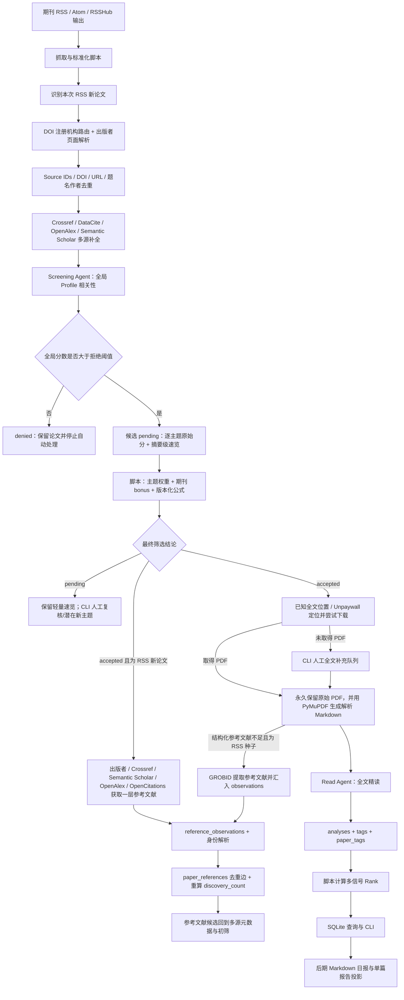

# 论文雷达系统：第一版最终讨论方案

> 文档性质：第一版的完整产品、数据与工程方案
>
> 决策基准：以 2026-09-06、2026-09-10 围绕本稿与 `daily-paper-reader` 调研形成的逐项确认作为最高优先级
>
> 外部资料核验日期：2026-09-10
>
> 系统定位：个人学术论文发现、筛选、全文精读与长期积累系统

## 一、目标与设计原则

论文雷达系统第一版要解决的不是“在哪里刷论文”，而是建立一条由自己掌控、能够长期稳定运行的学术信息管线：持续发现期刊新论文，先完成身份解析和元数据补全，再由全局 Research Profile 保留开放探索边界、由多个轻量关注主题控制自动晋级；只有自动或人工接受的 RSS 新论文才沿其一层参考文献向历史回溯，并进入全文精读。系统把论文、处理状态、摘要级速览、全文分析、标签和用户反馈可靠地保存下来，先通过数据库查询工具与命令行维护，数据闭环稳定后再生成 Markdown 日报和单篇报告。

系统遵循以下原则：

1. **独立建设，选择性借鉴。** 第一版建立独立的 Python 工程、领域模型、SQLite Schema 和任务状态机，不把外部公开项目作为运行底座。对 [`daily-paper-reader`](https://github.com/ziwenhahaha/daily-paper-reader) 的借鉴固定在核对过的 [`80c591fd46f84495196ea5479f48e4ca6b6f3189`](https://github.com/ziwenhahaha/daily-paper-reader/tree/80c591fd46f84495196ea5479f48e4ca6b6f3189) 快照：优先重写设计思想和行为测试，只有短小、无外部状态的纯函数才评估代码级复用，不建立 Fork、submodule 或 subtree 运行关系。
2. **普通程序掌握流程和事实，Agent 只做需要语义理解的工作。** RSS 抓取、条件请求、外部 API 调用、去重、状态迁移、文件下载、排名计算、持久化、日志和备份全部由确定性 Python 程序负责。
3. **第一版只有两个 Agent。** Screening Agent 分两个可恢复的调用阶段：先根据标题、摘要和全局 Research Profile 判断全局相关性，再为通过全局门槛的论文评价轻量主题并生成摘要级速览；它不读取期刊分、不决定权重和最终状态。Read Agent 只读取已经获得的全文并输出严格的结构化精读结果。
4. **全文是精读的硬前提。** 没有全文的论文不能进入 Read Agent。自动获取失败后，系统明确列入人工补充队列，文件补齐后从断点继续。
5. **内部身份与外部身份分离。** 每篇论文使用系统生成的 UUID 作为稳定主键，同时保存 DOI、DOI 注册机构、OpenAlex ID、Semantic Scholar ID、arXiv ID 等可获得的外部身份锚点；任何单一外部 ID 都不是入库硬前提。
6. **同一学术工作只保留一条核心论文记录。** 预印本、正式发表版或不同入口发现的同一工作尽量合并到同一个 UUID 下，并补充更完整的身份和出版信息。
7. **处理过程随时可恢复。** 每个阶段都先保存数据和状态，再进入下一阶段；单篇论文失败不能阻断整个批次。
8. **所有重要判断可追溯、可重算。** 保存模型供应商、模型名、提示词版本与哈希、Profile/主题/期刊配置版本与哈希、输入指纹、原始语义分、程序公式版本、分析时间和历史记录。修改纯计算配置时先 dry-run，再显式重算，不以重新调用模型代替确定性计算。
9. **数据模型优先于交互形式。** 第一版先完成稳定的数据层、服务层、查询工具和 CLI；Markdown 日报与单篇报告排在完整处理闭环之后，只是数据库事实的读取投影，不引入第一版 Web 管理后台。
10. **运行数据在本机，NAS 承担备份。** 活跃 SQLite 数据库不直接放在网络挂载目录上；数据库一致性快照和附件定期增量备份到同一局域网的 NAS。
11. **源文件与处理制品都保留。** Feed、DOI 注册机构、出版者页面、Crossref、DataCite、OpenAlex、Semantic Scholar 等来源的数据有独立快照和字段来源；全文原始 PDF 永久归档，解析后的 Markdown/纯文本按解析器版本留存，任何重跑都不静默覆盖旧版本。
12. **多源缺失不等于事实为空。** 外部来源的 404、缺字段或空引用列表只说明该来源当前没有数据。只有出版者结构化正文、注册机构元数据或经过校验的全文明确支持时，系统才能把“空参考文献”视为已确认事实。
13. **Profile 是开放式安全网，主题是自动晋级器。** 全局 Profile 只把明确无关论文置为 `denied`；通过 Profile、但没有任何轻量主题达到门槛的论文保持 `pending` 并进入“潜在新主题”复核视图，不能因主题配置不完整而消失。
14. **SQLite 是第一版唯一事实源。** 第一版不与 Supabase 双写；附件保存在本机内容寻址仓库，NAS 只承担备份。代码通过 repository/service 边界和 Alembic 保留未来迁移到 PostgreSQL 或 Supabase 的余地，但不承诺从第一天兼容两套数据库。

因此建设路线采用严格限定的“方案 2”：工程主体仍按本稿从零建立，只选择性吸收上游的配置编译、成功缓存、原子报告、逐阶段 trace 和行为测试经验。上游把自己定位为 GitHub Actions + GitHub Pages 的零服务器、Fork-and-Run 阅读站，参见其固定快照中的[项目说明](https://github.com/ziwenhahaha/daily-paper-reader/blob/80c591fd46f84495196ea5479f48e4ca6b6f3189/README.md#why-daily-paper-reader)和[主 workflow](https://github.com/ziwenhahaha/daily-paper-reader/blob/80c591fd46f84495196ea5479f48e4ca6b6f3189/.github/workflows/daily-paper-reader.yml)；PaperRadar 则以本机 SQLite、内容寻址附件、systemd 和 NAS 恢复为主干，直接 Fork 会先继承一套不同的状态与部署模型，不能节省真正的核心实现。

## 二、第一版总体结构



整条管线可以理解为五个稳定边界：

|边界|输入|输出|责任主体|
|---|---|---|---|
|发现边界|Feed 条目|标准化 RSS 候选；初筛通过后才采集其直接参考文献|Python 脚本|
|身份边界|来源不一、字段不齐且可能没有 OpenAlex 记录的候选项|去重后的唯一 `paper_id`|Python 脚本|
|理解边界|题名摘要、全局 Profile、轻量主题或完整全文|受 Pydantic 约束的原始语义判断；最终分数仍由程序计算|两个 Agent|
|持久化边界|元数据、状态、筛选评估、分析和附件|SQLite 行记录与本地文件|SQLModel、repository/service 与文件服务|
|展示边界|数据库查询结果和可选用户笔记|可原子重建的日报与单篇 Markdown|报告查询、渲染与发布模块|

## 三、端到端工作流

### 3.1 Feed 抓取与新论文识别

系统通过 `httpx` 发起 HTTP 请求，通过 `feedparser` 解析 RSS 或 Atom。某些期刊没有合适的原生 Feed 时，可以订阅自行部署的 RSSHub 所生成的标准 Feed；RSSHub 在这里只承担协议适配，不保存论文状态。[RSSHub 代码仓库](https://github.com/DIYgod/RSSHub)说明了其自部署和将网页来源转换为 RSS 的用途。

RSS 通常不是服务器主动推送，而是程序按频率轮询。每个 Feed 在 `feeds` 表中保存 `etag` 和 `last_modified`，后续请求带上 `If-None-Match` 或 `If-Modified-Since`。服务器返回 `304 Not Modified` 时只更新时间和健康状态，不重新解析或写入论文。[feedparser 的 ETag/Last-Modified 文档](https://feedparser.readthedocs.io/en/stable/http-etag.html)直接给出了将上次响应的 `etag`、`modified` 传入下一次解析请求的方式。

每个条目先转成确定性的 `FeedCandidate`：

```python
class FeedCandidate(BaseModel):
    feed_id: int
    entry_id: str | None
    title: str
    authors: list[str]
    published_at: datetime | None
    doi: str | None
    arxiv_id: str | None
    source_url: str
    canonical_url: str
    abstract: str | None
    raw_metadata: dict[str, Any]
```

这里不调用 LLM。程序执行字段清洗、日期解析、HTML 摘要净化、DOI 提取和 URL 规范化。判断“RSS 新论文”时，既要检查 Feed 条目的稳定 ID，也要进入全局论文身份匹配，不能把 Feed 自己的 GUID 当成论文的永久身份。

一篇论文可能此前已作为参考文献进入数据库，后来才出现在订阅 Feed 中。此时不创建第二条论文记录，而是在原记录上写入 `rss_discovered_at`、`source_feed_id`，并把 `global_screening_status` 与 `topic_screening_status` 重新设为 `not_started`。它必须先完成针对本次 RSS 发现的两阶段初筛；只有最新 `screening_decision = accepted` 且该结论记录的 `screening_rss_discovered_at` 与当前 `rss_discovered_at` 相同，才作为 RSS 种子启动一层参考文献采集及后续有限重查。这样不会误用它早先作为普通参考文献候选时得到的旧筛选结论。

第一版从某个 Feed 启用后的条目开始，不主动补抓往期期次，也不建立全网关键词、BM25、向量或混合检索语料库。自动进入系统的历史论文只来自 accepted RSS 种子的直接参考文献；人工附加既有论文或题录仍须经过同一身份解析、元数据与筛选流程，但不会因此启动额外历史层级。

### 3.2 多提供方身份与元数据路由

OpenAlex 是重要的增强源，但不是候选论文入库、身份成立或后续处理的硬前提。中文 DOI 可能由 ISTIC、CNKI 等注册机构管理而不在 Crossref 中；新发表论文也可能先出现基本 OpenAlex Work，之后出版者才向 Crossref 补交摘要或参考文献。第一版因此以本地 UUID 为主键、DOI 和来源 URL 为主要锚点，通过多个相互独立的提供方补全信息。

以下两篇论文构成截至 2026-09-10 的冻结核验基线，后续实现把响应保存为测试 fixture，不在测试运行时依赖外网当前值：

- DOI `10.11676/qxxb2026.20250055` 可正常解析，注册机构为 ISTIC；Crossref 无对应 Work，OpenAlex 按 DOI 和期刊 ISSN `0577-6619` 均未找到合适记录，但 [SciOpen 论文页](https://www.sciopen.com/article/10.11676/qxxb2026.20250055) 提供 5 位作者、摘要、出版日期和 PDF，平台参考文献接口当日返回 45 条，其中 42 条含 DOI。结论是“Crossref/OpenAlex 未命中”不能变成“论文不存在”，出版平台适配器和 DOI 内容协商是必要补位。
- DOI `10.1175/JPO-D-25-0212.1` 已有 OpenAlex Work `W7170144354`。冻结快照中，[OpenAlex Work](https://api.openalex.org/works/W7170144354) 的参考文献列表为 0、被引数为 0；[Crossref Work](https://api.crossref.org/works/10.1175/JPO-D-25-0212.1) 在 2026-09-09 更新后含 59 条参考文献，Semantic Scholar 返回 58 条、被引数为 0。结论是 OpenAlex 的 0 条参考文献属于来源覆盖或同步滞后，不能覆盖 Crossref 的完整列表；多个来源都报告被引数为 0，则只能表述为“这些来源截至各自时间尚未发现引用”。

“参考文献”与“被引”必须在术语和数据表中严格分开：前者是本论文指向旧论文的出边，用于一层历史回溯；后者是其他论文指向本论文的入边统计，通常更晚出现。新论文可以已经有几十条参考文献而仍然没有任何已知被引记录，等待一段时间可能改善两类数据，但不能保证所有提供方最终一致。

有 DOI 时，程序先调用 Crossref 的 `/works/{doi}/agency` 或 DOI Foundation 的 RA 查询识别注册机构，再选择元数据路线。[Crossref REST API](https://www.crossref.org/documentation/retrieve-metadata/rest-api/)明确提供 DOI agency 端点；[DOI Foundation](https://www.doi.org/the-community/existing-registration-agencies/)也说明不同注册机构服务不同社区，Chinese DOI 由 ISTIC 与万方运行。路由规则为：

1. DOI 统一规范化并验证可解析性，保存 `doi_registration_agency`；DOI 能解析但注册机构元数据不公开时，仍是有效身份锚点。
2. Crossref DOI 请求 Crossref 单条记录；DataCite DOI 请求 DataCite；其他注册机构先尝试通过 `doi.org` 的 CSL JSON 内容协商获取基本题录。
3. 无论注册机构为何，只要有合法论文落地页，就解析标准 `citation_*`、Dublin Core、JSON-LD 或 JATS 元数据。通用解析器失败后，可按域名启用小型出版平台适配器，例如 SciOpen 的文章页与参考文献接口。
4. OpenAlex、Semantic Scholar 随后作为外部 ID、版本桥接、摘要、位置和主题的增强源；它们返回 404、零结果或缺字段不阻断流程。
5. 无 DOI 时使用 arXiv ID、PMID/PMCID、出版者 ID、规范 URL，再以标题、作者、年份做保守匹配；任何模糊命中都必须通过一致性阈值。

替代来源与兜底按“结构化、可追溯、获准自动访问”的原则接入：出版者 JATS/HTML/API 和 DOI 注册机构优先，Crossref/DataCite、Semantic Scholar、OpenAlex、OpenCitations 等开放服务各自作为独立观察源，已合法取得的 PDF 最后由 GROBID 提取。若某个中文平台没有稳定公开接口，第一版允许用户把该平台导出的 RIS、BibTeX 或 CSL JSON 附加到已有论文；它写成 `manual_import` 来源快照并经过同一套标准化与冲突检查，不直接覆盖权威非空字段。以后如取得 Scopus、Web of Science、Dimensions 等来源的合法 API 权限，可增加普通 provider adapter，但不改变本地数据模型。第一版不自动抓取需要登录、验证码或没有明确自动化许可的检索结果页面。

通用字段不采用“后调用者覆盖前调用者”。正式出版信息通常优先使用出版者结构化元数据或对应注册机构记录；Feed 值用于发现和追溯；OpenAlex、Semantic Scholar用于补空值与版本桥接。ISSN 冲突时以精确 ISSN 为判断依据，不能只凭英文刊名自动合并，例如中文刊与历史英文版可能共享或近似同一个英文名称。空值永远不能覆盖非空值，实质冲突写入 `metadata_conflict`。

每次外部响应写入不可变的 `provider_snapshots`，至少记录提供方、用途、查询键、抓取时间、上游更新时间、HTTP 状态、响应哈希和原始响应或经过可逆裁剪的响应；`metadata_sources_json` 则记录每个当前通用字段采用哪个快照。来源后来补交数据时创建新快照并重新仲裁，不静默改写历史。每个“论文 × 提供方 × 用途 × 查询键”的当前成功状态、重试次数和下次刷新时间另存于 `provider_sync_states`，避免一个来源失败拖慢其他来源。

OpenAlex 成功命中时，保存规范 `openalex_id` 以及经格式校验的 DOI、PMID、PMCID、作者、出版日期、来源、位置、语言和可还原摘要。OpenAlex Work 的 `ids` 不保证存在独立 `arxiv_id`；`arxiv_id` 应优先从 Feed、arXiv URL、Semantic Scholar external IDs 或出版者页面提取。OpenAlex 的合并 Work ID仍是正式版与预印本的重要桥梁；旧 ID 重定向时允许跟随并写回最终规范 ID。[OpenAlex Works 属性](https://help.openalex.org/data/works/attributes/)和 [Locations 文档](https://help.openalex.org/data/locations/)分别说明了当前 ID 字段和多版本位置结构。

外部全网被引数与本地 `discovery_count` 始终分离。OpenAlex、Semantic Scholar、Crossref、OpenCitations 返回的被引数按“提供方 + 数值 + 抓取时间”写入 `citation_metric_snapshots`，只供展示和将来分析，不进入第一版 Rank，也不把任何单源的零值描述成“全球确定为零”。

论文首次发现时立即查询；仍缺数据的提供方随后按距 `discovered_at` 的 `1、3、7、14、30、90` 天检查点有限重查，已经错过的检查点不补发密集请求。一旦已从可靠来源取得所需字段，可以停止对应字段的密集重查。超过窗口仍缺少 OpenAlex ID 或某项元数据时转为长期低频刷新或人工队列，不无限重试。OpenAlex 官方建议 DOI 已注册但数周后仍缺失时提交缺失记录工单；这种外部协调是数据修复手段，不是本地流程的前置条件。[OpenAlex 收录说明](https://help.openalex.org/how-to/getting-indexed/)

### 3.3 全局身份解析与去重

数据库中的 `papers.id` 是 UUID v4。外部 ID 可以补充或纠正，内部 UUID 一旦创建就不改变。SQLModel 已原生支持 UUID，SQLite 会将其存为字符串表示；这与未来跨机器合并数据时不依赖自增序号的需求一致。[SQLModel UUID 文档](https://sqlmodel.tiangolo.com/advanced/uuid/)介绍了 `default_factory=uuid.uuid4` 和 SQLite 中的存储行为。

#### 3.3.1 标准化规则

- DOI：转小写，去除 `doi:`、`https://doi.org/`、首尾空白以及结尾误带标点；保存规范 DOI，不把 DOI URL 当作另一身份。
- arXiv ID：去除 `arXiv:` 和 URL 前缀；用于工作级去重时去掉版本后缀 `vN`。
- OpenAlex ID：保存短格式 `W...`，跟随重定向后更新为规范 ID。
- PMID、PMCID：去除 URL 和命名空间前缀，保留规范主体。
- URL：主机名小写，移除 fragment 和已知跟踪参数，统一 DOI URL，保留实际论文落地页所需的查询参数。
- 标题：Unicode 规范化、大小写折叠、合并空白、去外围标点；原始标题仍单独保存。
- 作者：保留完整作者列表，同时生成规范化第一作者供辅助匹配。

#### 3.3.2 匹配优先级

Resolution Engine 按以下顺序匹配：

1. DOI 精确匹配；
2. arXiv ID、PMID、PMCID、OpenAlex ID、Semantic Scholar ID 或出版者 ID 精确匹配；
3. 通过任一外部提供方得到的规范 ID 或关联身份再次精确匹配；
4. canonical URL 精确匹配；
5. 规范化标题精确匹配；
6. 标题 + 第一作者 + 年份匹配；
7. 标题模糊相似度 + 作者/年份一致性检查。

前四级高置信匹配可以自动合并。第五、六级只有在作者或年份等辅助信号没有冲突时才自动合并。第七级只标记 `dedupe_review_required = true`，由 CLI 列出并人工确认，不能由模糊标题单独触发自动合并。

#### 3.3.3 合并规则

匹配为同一工作后，只保留一个 UUID：

- 原记录的 UUID、最早 `discovered_at`、已有分析和附件全部保留；
- 新出现的非空外部 ID补入原记录；
- 规范出版信息优先采用出版者结构化元数据或 DOI 对应注册机构返回的字段；
- 原有非空字段不能被空值覆盖；
- 标题、作者、期刊或年份发生冲突时保存 `metadata_conflict = true` 和简短原因，等待 CLI 复核；
- 如果原记录只有 arXiv ID，而新记录带正式 DOI，则给原记录补 DOI、期刊和正式落地页，不新建论文；
- 合并重复记录时，先把 `reference_observations` 和 `paper_references` 重指向存活 UUID，并依靠 `(citing_paper_id, cited_paper_id)` 唯一约束折叠重复边，再从引用边重算 `discovery_count`，不直接相加或取较大值；
- `report_entries` 重指向存活 UUID 时若同一日报发生组合主键冲突，只保留一个成员；`analyzed` 优先于 `pending`，同类条目保留指向当前有效 assessment/analysis 的记录，不在报告中制造重复论文；
- 合并动作使用事务，关联的 `screening_assessments`、来源快照、提供方同步游标、引用观察、引用边、被引指标快照、`analyses`、`paper_tags`、`user_feedback` 和 `report_entries` 均保持指向存活 UUID。

DOI、arXiv ID、OpenAlex ID、Semantic Scholar ID、PMID、PMCID 等具有稳定全局语义的外部 ID 建唯一索引，利用数据库约束作为最后一道防重保护。出版者内部 ID 必须连同平台命名空间匹配，不把不同平台碰巧相同的值视为同一身份。插入遇到唯一约束竞争时，事务回滚并重新读取已存在记录，而不是绕过约束。

### 3.4 多源元数据补全与一层参考文献采集

#### 3.4.1 元数据补全与就绪门槛

所有去重后的 RSS 新论文，以及 accepted RSS 种子产生的直接参考文献候选，都进入同一个可重跑的 Enrichment Pipeline：

- 按 DOI 注册机构路由到 Crossref、DataCite 或 DOI 内容协商；
- 解析出版者落地页中的 Highwire `citation_*`、Dublin Core、JSON-LD、JATS/XML 和 PDF URL；
- 用 OpenAlex、Semantic Scholar 补充外部身份、摘要、版本位置和其他可用字段；
- 无 DOI 时使用标题、作者、年份做保守 bibliographic query，只在唯一候选达到严格阈值时补充外部 ID；
- 每个响应按 DOI、URL 或查询指纹缓存并写来源快照，避免重复请求且允许日后重新仲裁。

[Crossref REST API 说明](https://www.crossref.org/documentation/retrieve-metadata/rest-api/)指出其接口只返回成员和可信来源向 Crossref 提交的数据；有效 DOI 可以属于其他注册机构，因此 Crossref 404 必须触发下一条路线，而不是判定论文不存在。Crossref、DataCite、出版者页面或 OpenAlex 都可能缺少部分字段，Schema 必须允许合理的 `NULL`。[Crossref 接入与认证说明](https://www.crossref.org/documentation/retrieve-metadata/rest-api/access-and-authentication/)建议请求携带 `mailto` 和可识别的 `User-Agent`、缓存结果、监控 HTTP 状态并在响应变慢或限流时退避；所有提供方客户端都采用各自的限速与退避配置。

完成最低元数据要求后，论文从 `new` 进入 `metadata_ready`。最低要求是：规范标题、可供初筛的摘要、至少一个可靠来源 URL，以及已经尝试过适用的身份与元数据路线；不要求必须有 OpenAlex ID或 Crossref 记录。摘要仍缺失时保留记录并列入元数据待补队列，不只用标题冒充“标题 + 摘要”初筛。

#### 3.4.2 accepted RSS 种子的多源参考文献采集

只有同时满足 `rss_discovered_at IS NOT NULL`、当前 `screening_decision = accepted` 且 `screening_rss_discovered_at = rss_discovered_at` 的论文才有资格采集直接参考文献。这里检查的是明确针对本次 RSS 发现形成的持久筛选结论，而不是时间先后猜测，也不是可能已经推进到 `fulltext_ready` 或 `analyzed` 的主流程状态。仅作为参考文献进入系统的论文即使筛选结论为 `accepted`，也不继续展开；只有它以后被 RSS 正式发现并再次通过初筛，才获得 RSS 种子资格，从而保证历史回溯严格只有一层。

参考文献来源按可靠性与及时性分层，但不是命中一个来源后永远停止：

1. 优先取得出版者提供的 JATS/XML、结构化 HTML/JSON 或平台接口；例如 SciOpen 文章页可提供完整题录并由页面公开接口返回参考文献。
2. Crossref 记录含 `reference` 时保存其完整列表，包括只有 `unstructured` 字符串而没有 DOI 的条目。出版者向 Crossref 补交参考文献可能晚于论文首次登记，因此该来源允许定期刷新。[Crossref References 文档](https://www.crossref.org/documentation/schema-library/markup-guide-metadata-segments/references/)说明参考文献是出版者可在初次或后续提交的可选元数据。
3. Semantic Scholar 与 OpenAlex 提供已解析的图谱边和外部 Paper/Work ID，用于补充和交叉核验；有 DOI 时也可请求 OpenCitations 的 `/references/{id}`。OpenAlex 的 `referenced_works` 只包含成功连接到 OpenAlex Work 的条目；其空数组不能证明原论文参考文献表为空。[OpenAlex 引文说明](https://help.openalex.org/data/works/citations/)列出的缺失原因包括上游未提供列表、被引工作不在 OpenAlex 以及元数据匹配失败。[OpenCitations Index API](https://api.opencitations.net/index/v2)则明确区分 `/references/{id}` 出边、`/citations/{id}` 入边和各自的 count 端点，三者必须按用途分别采集。
4. 结构化来源不可用、明显不完整或相互矛盾，而合法 PDF 已取得时，用 GROBID `processReferences` 提取原始参考文献与结构化字段。[GROBID 服务文档](https://grobid.readthedocs.io/en/latest/Grobid-service/)提供独立的参考文献提取接口；第一版保留原始字符串并对自动匹配设置置信度门槛。

每个来源的每条结果先写入 `reference_observations`，再交给全局 Resolution Engine。程序按 DOI 和其他强 ID 精确解析；无强 ID 时使用标题、作者、年份做保守匹配。解析成功后 upsert 唯一的 `paper_references(citing_paper_id, cited_paper_id)`，同一个来源重跑、不同来源报告同一条引用或后续来源补齐 DOI 都不能生成重复规范边。

参考文献采集与解析使用两个状态维度：

- `reference_harvest_status` 表示是否取得了可信的原始列表，可为 `not_eligible`、`eligible`、`collecting`、`partial`、`complete`、`unavailable`、`not_applicable`；
- `reference_resolution_status` 表示原始条目是否已解析为本地论文，可为 `not_applicable`、`pending`、`partial`、`complete`。

每个来源先独立标注列表完整性，不能让 OpenAlex 的空数组覆盖 Crossref 或出版者的非空列表。`complete` 只表示至少一个可靠来源的整份列表已经被完整保存，不要求每条引用都已解析；解析不全由第二个状态表达。当来源自报数量与实际条目数不一致、不同可靠来源差异显著、或只得到已匹配图谱边时，采集状态是 `partial`。只有出版者结构化数据、注册机构记录或 PDF 明确显示没有参考文献，才能确认“空列表完成”；任一聚合源单独返回空数组时保持 `partial` 或进入有限重试。对于上述英文冻结样例，Crossref 自报 59 条且实际保存 59 条，因此论文级采集状态可为 `complete`；OpenAlex 仍保留为该来源的“未确认空”，Semantic Scholar 的 58 条作为不完整观察，解析状态则按实际映射结果另算。

采集事务一次提交本批新增或更新的 observations、新建或合并的被引论文、规范引用边和受影响论文的 `discovery_count`。任务中途失败则整批回滚；重跑依靠观察指纹和规范边唯一约束幂等。来源日后补交新引用时只新增此前不存在的边；可靠完整列表若明确撤回旧条目，则只退役该来源的证据，边在没有其他有效证据时才失活并触发计数重算。部分响应、超时或未确认空列表不能撤回任何旧证据。

`discovery_count` 的严格含义是：

> 该论文被多少篇在引用边首次进入系统时具有 `screening_decision = accepted` 的 RSS 种子直接引用。

规范边保存 `discovery_eligible`，在筛选结论为 accepted 的 RSS 种子所产生的引用观察首次形成该边时设为真。`discovery_count` 是对符合条件且仍活动的不同 `citing_paper_id` 计数后写回 `papers` 的可重算缓存，不统计 Feed 重复抓取、提供方重复报告或任务重跑。种子日后被人工改为其他筛选结论不会追溯扣减历史发现；先为 `pending`、后变为 `accepted` 的 RSS 论文只有实际采集并形成引用边时才贡献计数。若出版者更正等可信完整来源撤回引用且该边已无其他有效证据，计数可以在审计可追溯的前提下减少。

新产生的被引论文候选回到本节 3.4.1 的多源补全与初筛流程；其筛选结果决定自身是否获取全文，但不会触发下一层参考文献扩展。参考文献采集失败或长期不可用不会阻塞同一 accepted 论文的全文获取和精读，两条任务线独立推进。

### 3.5 初筛 Agent

第一版采用一个 Screening Agent、两个可独立恢复的调用阶段。两个阶段只处理语义判断；脚本负责阈值、主题权重、期刊加分和最终状态，因此相同原始分与同一版配置必然得到相同结论。

第一阶段只接收论文标题、摘要、完整的全局 Research Profile、评分规则和输出 Schema，判断论文是否落在开放的研究兴趣边界内：

```python
class GlobalScreeningOutput(BaseModel):
    relevance_score: int  # 运行时 Schema 按配置量表约束；启动默认 0～100
    relevance_reason: str
```

程序以可配置的 `global_deny_at_or_below` 映射该原始分。启动默认值为 35：`relevance_score <= 35` 时写入 `denied`；大于 35 时先写入安全的 `pending`，再进入第二阶段。全局分数不加入后面的主题总分，它只承担开放式门控，确保明确无关的论文停止推进、可能相关的新方向不会因主题清单不完整而被丢弃。

第二阶段接收同一标题和摘要，以及所有启用的轻量主题；它不知道各主题权重、期刊分和最终接受阈值。每个启用主题必须恰好返回一次，`topic_id` 只能来自程序提供的允许集合：

```python
class TopicMatchOutput(BaseModel):
    topic_id: str
    relevance_score: int  # 运行时 Schema 按配置量表约束；启动默认 0～100
    reason: str


class PendingBriefOutput(BaseModel):
    abstract_brief: str
    one_sentence_takeaway: str
    why_relevant_to_me: str
    review_reason: str
    topic_matches: list[TopicMatchOutput]
```

`abstract_brief`、`one_sentence_takeaway` 和 `why_relevant_to_me` 必须明确使用“根据标题和摘要”“摘要显示”等措辞，不能声称已经读取全文。它们是筛选制品，不属于 `analyses`，也不包含 Read Agent 的方法、数据、局限、复用难度等全文字段。论文随后自动晋级为 `accepted` 时仍保留这份筛选历史，但完整精读方案不变；最终没有晋级时，它就是 `pending` 队列和首次日报使用的轻量速览。

如果没有配置任何启用主题，第二阶段仍可生成摘要级速览，`topic_matches` 为空，论文保持 `pending`。模型遗漏主题、重复主题或返回未知 ID 时，Schema 后的业务校验失败；程序在有限预算内重试，不能用缺项补零后继续计算。

`paper_id`、模型元信息、提示词版本、Profile/主题版本、输入指纹和时间均由程序注入。每个成功阶段追加写入 `screening_assessments`；`papers` 只镜像当前列表查询和任务选择所需的结论、分数与配置版本。全局阶段成功、主题阶段暂时失败时，论文安全地保持 `pending`，同时将主题阶段标为可重试错误，而不是退回 `metadata_ready` 或误升为 `accepted`。

#### 3.5.1 第一版确定性主题与期刊评分

对每个启用主题 `i`，程序读取 Agent 的原始分和用户配置的权重；启动分数量表为 0–100：

```text
weighted_topic_score_i = score_scale_min + (
    raw_topic_score_i - score_scale_min
) × topic_weight_i
topic_score = min(score_scale_max, max(weighted_topic_score_i))
```

主题权重的启动合法范围为 `0 < weight <= 1`，启动默认值为 1；上下界同样来自配置。多个主题的分数不求和而取最大值，因此增加相近主题不会仅凭主题数量抬高论文分数；在默认范围内，降低某个主题权重只会降低它的自动晋级能力，若暂时不使用某主题则设置 `enabled: false`。

启动默认值和公式如下，所有数值都可在配置中手动修改：

```yaml
screening:
  scoring_version: "profile-topics-journal-v1"
  score_scale:
    min: 0
    max: 100
  global_deny_at_or_below: 35
  topic_weight:
    min_exclusive: 0
    max: 1
  minimum_topic_gate: 60
  accept_at_or_above: 75
  journal_score:
    min: 0
    max: 100
  journal_bonus_max: 10
```

```text
if no enabled topic or topic_score < minimum_topic_gate:
    decision = pending
    journal_bonus = 0
    final_screening_score = null
else if journal_score_status == conflict:
    decision = pending
    journal_bonus = null
    final_screening_score = null
else:
    if journal_score_status == matched:
        normalized_journal_score = (
            (journal_score - journal_score_min)
            / (journal_score_max - journal_score_min)
        )
        journal_bonus = normalized_journal_score × journal_bonus_max
    else:  # missing
        journal_bonus = 0
    final_screening_score = min(score_scale_max, topic_score + journal_bonus)
    decision = accepted if final_screening_score >= accept_at_or_above else pending
```

期刊配置由用户维护，使用规范 ISSN 或 ISSN-L 作为键，期刊名只用于展示；`journal_score` 启动范围为 0–100，启动映射把它线性转换为最高 10 分的 bonus。期刊 bonus 只有主题分先达到启动门槛 60 后才生效，所以高期刊分不能单独把论文推进 `accepted`。论文无法可靠匹配期刊配置时，评估记录必须保存 `journal_score_status = missing`，计算贡献为 0，但界面和日志不得把它表述为“该期刊得分为 0”。ISSN 冲突或多个键得到不同分数时不自动取最高值，保持 `pending` 并进入配置复核。

分数量表、全局门槛、主题门槛、权重范围、期刊分范围、bonus 映射、bonus 上限和接受阈值都由 Pydantic Settings 读取和校验，不在业务函数中写死。启动默认仍是本节列出的 0–100、35、`(0, 1]`、60、10 和 75。若修改 Agent 分数量表本身，必须同时递增输出契约与提示词版本并重跑相应 Agent；只改阈值、权重和期刊换算则可复用原始分。每次运行保存所用原始主题分、匹配主题、实际权重、期刊键、期刊分或缺失状态、bonus、最终分和公式版本。全局 Profile 分、主题筛选分和全文后的 `rank_score` 是三个独立概念，不互相替代或混算。

修改阈值、已有主题的权重、期刊分或 bonus 上限时，先运行 `paper-radar screening reclassify --dry-run`，确认后再用已保存的 Agent 原始分创建一条新的重分类评估，不重新调用模型、不静默覆盖历史。新增、删除、启停主题，或修改主题名称/描述会改变 Agent 的语义输入，必须只对受影响论文重跑主题阶段；为此主题配置分别计算“语义定义哈希”和“权重配置哈希”。修改全局 Profile、标题、摘要、模型或提示词同样使对应 Agent 缓存失效。

#### 3.5.2 输入指纹与成功结果缓存

全局阶段输入指纹至少包含规范标题、摘要、Profile 哈希、模型、提示词哈希和输出契约版本；主题阶段再加入启用主题的语义定义哈希。主题权重和期刊配置不进入 LLM 输入指纹，而进入确定性评分版本与评估快照。只有非空、通过 Pydantic 与业务完整性校验的成功输出才能缓存；超时、截断 JSON、未知主题和占位内容都不得成为可复用结果。

这一行为借鉴了 `daily-paper-reader` 按调用类型、输入、模型和服务地址生成 SHA-256，并只原子缓存完整成功结果的做法，参见固定快照中的 [`cache_reading_generators`](https://github.com/ziwenhahaha/daily-paper-reader/blob/80c591fd46f84495196ea5479f48e4ca6b6f3189/src/long_range_native.py#L21-L73)。PaperRadar 不复制其装饰器式实现，而是定义显式的 `Fingerprint` 值对象和 repository/service API；缓存命中仍要重新验证当前业务前置条件，不能直接推动状态。

### 3.6 三种筛选结论与人工改动

`screening_decision` 持久保存初筛结论，`accepted`、`denied`、`pending` 是三个互斥值。它与 `papers.status` 分离：前者决定论文是否有资格继续自动处理，后者描述主流程当前推进到哪里。这样全文链先完成时，不会使尚未完成的参考文献链丢失 accepted 资格。

- `accepted`：RSS 种子取得参考文献采集资格，同时进入全文获取；非 RSS 候选只进入全文获取；主流程日后可继续变为 `fulltext_ready`、`analyzed` 或 `delivered`，筛选结论仍保留；
- `denied`：保留论文和初筛依据，但停止自动推进；
- `pending`：已通过全局 Profile 门控，但尚未完成主题阶段、没有启用主题、最高加权主题分未达到门槛、最终分未达到接受阈值、期刊配置冲突，或需要人工判断；主题阶段成功时保留摘要级速览，尚未成功时明确标为缺失并等待自动重试、配置重算或人工决定。

其中“主题阶段已经成功，且通过全局 Profile、但没有任何主题达到自动晋级门槛”的论文标记为 `profile_only_candidate = true`，进入潜在新主题复核视图；主题阶段尚未完成时该字段保持 false，并由 `topic_screening_status` 表明“尚未得出结论”，不冒充 Profile-only。这个标记只帮助发现主题体系的盲区，不降低全局分，也不自动创建新主题。具备有效轻量速览的 `pending` 论文在本轮状态首次真正发布到日报时出现一次，不跨日报结转；它在数据库和 CLI 队列中一直保留，直到用户处理或后续重分类。

CLI 从第一版起就支持显式修改状态：

```bash
paper-radar screening set-decision <paper_id> accepted --reason "人工确认值得精读"
paper-radar screening set-decision <paper_id> denied --reason "人工确认不在当前研究范围"
```

筛选结论修改必须记录操作者来源、旧结论、新结论、原因和时间。若主流程尚未越过筛选阶段，则把 `papers.status` 同步为新的筛选结论；RSS 论文发生 `pending → accepted` 或 `denied → accepted` 后，参考文献采集和全文获取分别依据 `screening_decision` 取得任务资格并可独立推进。非 RSS 论文只继续全文获取。已到下游状态的论文改为 `denied` 时保留已有 PDF、分析和历史引用边，但停止尚未开始的新自动任务；人工结论的优先级高于旧的 Agent 判断，除非用户显式要求重新初筛。

任何路径从非 `pending` 进入 `pending` 时写入新的 `pending_since`；`pending → pending` 的主题重试或确定性重分类不改变它，离开 `pending` 时清空。人工设置结论会新增一条来源为 `manual` 的筛选评估，并更新 `screening_decided_at` 与当时的 `screening_rss_discovered_at`；不得改写 Agent 原始分。人工把论文设为 `pending` 时沿用最近一份有效轻量速览；若从未成功生成速览，则明确显示“速览缺失”，不调用 Read Agent 或伪造内容。

### 3.7 全文获取与人工补充

所有 `screening_decision = accepted` 的论文都可以进入全文获取，不以参考文献采集状态或当前主状态仍停留在 `accepted` 为前置条件。这样结构化参考文献暂缺时仍可取得 PDF 并用 GROBID 兜底，也不会因为外部图谱更新延迟而阻塞 Read Agent。程序先检查本地是否已经有与该 UUID 对应且校验通过的 PDF；没有时按以下顺序处理：

1. 检查 Feed、出版者页面、DOI 注册机构、arXiv、OpenAlex 和 Semantic Scholar 快照中已知的合法 PDF 或仓储位置。
2. 有 DOI 时调用 Unpaywall `GET /v2/{doi}?email=...`，优先使用 `best_oa_location.url_for_pdf`；没有直接 PDF 时可检查合法 OA 落地页。
3. 无 DOI 或 Unpaywall 无记录时，不立即断言无全文；先使用已知出版者/仓储 URL，再进入人工全文补充队列。
4. 下载设置连接、读取和总超时，限制最大文件大小，并遵循重定向。
5. 验证 HTTP 状态、Content-Type、PDF 文件签名和最小体积。
6. 先写临时文件，计算 SHA-256，校验成功后以内容哈希命名并原子移动到正式附件目录。通过校验的原始 PDF 是长期保留的源文件，不因解析成功、重新解析或后续取得另一版本而删除。
7. 更新 `fulltext_status`、当前 `pdf_path`、`pdf_sha256`、`pdf_source_url` 和取得时间，并把该版本追加到附件清单。

[Unpaywall REST API](https://unpaywall.org/api)说明其单 DOI 端点要求在请求中携带邮箱；[Unpaywall 数据格式](https://unpaywall.org/data-format)定义了 `best_oa_location` 等字段。Unpaywall 在系统中的职责是定位合法开放版本，不能把普通出版社落地页或 HTML 错存成 PDF。

自动获取失败不等于论文被拒绝。论文保持 `screening_decision = accepted`；若主状态尚未继续推进则仍为 `accepted`，同时将 `fulltext_status` 设置为：

- `manual_required`：没有可自动取得的全文；
- `download_retry`：短暂网络或限流错误，可按计划重试；
- `invalid_file`：返回内容不是可用 PDF；
- `pdf_ready`：原始 PDF 已验证并归档，等待解析；
- `parsing`：正在为当前 PDF 生成解析制品；
- `parsed_ready`：当前解析 Markdown 已通过质量门槛；
- `extraction_failed`：PDF 存在但文本提取失败。

人工流程采用固定收件目录：

```text
data/inbox/pdfs/<paper_uuid>.pdf
```

`paper-radar paper needs-pdf` 列出 UUID、题名、DOI、原文链接和目标文件名。用户把合法获得的全文放入该目录后，`paper-radar fulltext import-inbox` 执行同样的 PDF 校验、哈希计算和原子入库，将 `fulltext_status` 推进为 `pdf_ready`；解析任务成功后，论文主状态才进入 `fulltext_ready`。也可以使用：

```bash
paper-radar fulltext attach <paper_id> /path/to/paper.pdf
```

附件采用“不可变源文件 + 可再生但仍留存的解析制品”布局：

```text
data/attachments/papers/<paper_uuid>/
├── manifest.json
├── source/
│   └── <pdf_sha256>.pdf
├── parsed/
│   └── pymupdf-<parser_version>/
│       ├── <pdf_sha256>.md
│       └── <pdf_sha256>.txt
└── references/
    └── grobid-<grobid_version>/
        └── <pdf_sha256>.references.tei.xml
```

`manifest.json` 记录每个 PDF 的来源 URL、取得方式、取得时间、哈希、文件大小、正文解析器及其版本、GROBID 版本、对应解析制品和当前版本指针。数据库中的路径指向当前用于分析的 PDF 与 Markdown，但清单保留全部历史映射和参考文献 TEI。重复上传同一哈希时不重复保存；上传不同哈希时新增源文件和清单项，不覆盖或删除已经分析过的全文。切换当前版本是单独的、带审计日志的操作。

文件系统与 SQLite 无法共享一个事务，因此附件服务使用可恢复的提交顺序：先在同一文件系统写临时文件、校验并 `fsync`，再原子重命名为内容哈希路径；随后用短数据库事务更新当前指针，最后以临时文件 + 原子替换方式刷新清单。任一步崩溃后，`fulltext verify` 都能根据哈希发现孤立文件或缺失清单并安全重建，而不会覆盖已归档文件。

### 3.8 PDF 文本与参考文献提取

全文由 PyMuPDF 按页提取。第一版同时保留原始 PDF、面向 Read Agent 的 UTF-8 Markdown 和便于排障的分页纯文本。Markdown 是内部全文解析制品，不是面向用户的论文报告：它尽量保留标题层级、段落、列表与页界，在无法可靠识别结构时忠实降级为普通段落；纯文本保留明确分页分隔符。[PyMuPDF 基础文档](https://pymupdf.readthedocs.io/en/latest/the-basics.html)展示了逐页 `page.get_text()` 的标准方法；其 [文本提取说明](https://pymupdf.readthedocs.io/en/latest/recipes-text.html)也提醒 PDF 内部文本顺序可能与自然阅读顺序不同。

解析器名称、解析器版本、解析配置版本和源 `pdf_sha256` 一起决定制品目录及文件名。升级 PyMuPDF 或调整版面恢复规则时，程序生成一个新的解析版本，不原地覆盖旧 Markdown；只有新制品通过质量检查后，才原子更新数据库中的“当前解析版本”指针。这样既能复现旧分析，也能在解析器改进后安全重跑。

提取程序执行以下检查：

- 能否打开 PDF；
- 是否加密且无法读取；
- 页数是否大于零；
- 提取字符数和有文本页面比例是否达到配置阈值；
- 解析 Markdown 与纯文本是否都能追溯到当前 PDF 的 SHA-256；
- 两种解析制品各自的 SHA-256 是否与附件清单和数据库一致；
- 明显异常的重复页眉、空页比例和乱码比例。

提取质量不足时仍保留已经校验的原始 PDF，设置 `fulltext_status = extraction_failed`，记录失败解析器、版本和原因并进入 CLI 异常队列，不把空 Markdown 送入 Read Agent。失败产生的临时文件不设为当前制品；若为诊断而保留，也必须在清单中标为 `failed`。

#### 3.8.1 GROBID 参考文献兜底

PyMuPDF 继续负责面向 Read Agent 的正文 Markdown；GROBID 只承担 PDF 中参考文献区的结构化提取，二者不能混成同一个解析状态。仅当论文是 `screening_decision = accepted` 的 RSS 种子，且出版者、Crossref、Semantic Scholar、OpenAlex、OpenCitations 等来源的参考文献仍为 `partial` 或 `unavailable` 时，任务才对已经归档的 PDF 调用 `processReferences`，并启用 `includeRawCitations=1`。

GROBID 输出的原始 TEI XML 按 `grobid_version + pdf_sha256` 版本化保存并登记到附件清单，随后逐条写入 `reference_observations`。第一版默认关闭 GROBID 自带的 Crossref consolidation，由本系统统一 Resolution Engine 执行 DOI 和题录匹配，避免把 Crossref 覆盖范围误当成全部参考文献；如以后启用 consolidation，必须把其版本和配置哈希写入观察来源。

GROBID 提取成功只表示获得了一份机器解析结果，不自动证明列表完整。程序至少比较 PDF 页数、提取条数、是否保留原始字符串、与其他来源报告数量的差异，并将低质量结果标为 `partial`。GROBID 失败不影响正文 Markdown、Read Agent 或人工全文流程。

Schema 迁移文件中保留一条设计注释：如果后续启用结论证据定位，再为精读结构增加 `evidence_locations`，通过正式迁移添加，第一版不创建该列。

### 3.9 Read Agent 全文精读

Read Agent 只处理同时满足以下条件的论文：

- `screening_decision = accepted`；
- `status = fulltext_ready`；
- PDF 已校验；
- 当前解析 Markdown 通过质量门槛；
- 当前 PDF 哈希与解析 Markdown 哈希没有对应的成功精读分析，或者用户显式要求重跑。

Read Agent 每次读取完整的自由文本 Research Profile、版本化精读提示词、论文元数据和当前解析 Markdown。原始 PDF 作为可追溯源文件保留，但第一版不直接把二进制 PDF 交给模型。输出模型至少包含：

```python
class ReadAnalysisOutput(BaseModel):
    one_sentence_conclusion: str
    research_question: str
    methods: str
    data: str
    main_findings: list[str]
    tags: list[str]
    priority: Literal["low", "medium", "high", "urgent"]
    urgency_score: int = Field(ge=0, le=100)
    urgency_reason: str
    why_relevant_to_me: str
    relevance_score: int = Field(ge=0, le=100)
    reuse_difficulty: Literal["easy", "hard", "almost_impossible"]
    reuse_difficulty_reason: str
    reusable_points: list[str]
    limitations_and_questions: list[str]
    next_action: str
```

以下字段由程序追加后形成最终持久化对象：

```python
class PersistedReadAnalysis(ReadAnalysisOutput):
    id: UUID
    paper_id: UUID
    provider: str
    model: str
    prompt_version: str
    prompt_sha256: str
    research_profile_version: str
    research_profile_sha256: str
    pdf_sha256: str
    parsed_markdown_sha256: str
    parser_name: str
    parser_version: str
    discovery_count_at_analysis: int
    analyzed_at: datetime
    input_tokens: int | None
    output_tokens: int | None
```

`paper_id` 必须指向已经存在的 `papers.id`，由应用程序注入并受数据库外键约束。每次成功精读新增一行 `analyses`，不覆盖旧分析；同一论文可以因模型、提示词或全文版本变化而拥有多次分析。默认查询取 `analyzed_at` 最新且成功的一行，CLI 可查看完整历史。

Read Agent 给出的 `tags` 不在 `analyses` 中重复保存为逗号字符串。程序在同一事务中规范化标签、向 `tags` 表 upsert，并向 `paper_tags` 写入论文—标签对应关系。因此 Pydantic 输出具有 `tags: list[str]`，关系型数据库则用标准多对多结构表达它。

精读完成并持久化成功后：

1. 将当前分析中的紧急程度和复用难度镜像到 `papers` 的当前查询字段；
2. 运行脚本化 Rank 计算；
3. 将 `papers.status` 更新为 `analyzed`；
4. 只有全部数据库写入成功才提交事务。

### 3.10 多信号 Rank

第一版 Rank 只采用三个信号：紧急程度、复用难度、被新论文直接引用发现的次数。相关性分数用于初筛和查询展示，不进入第一版 Rank 公式。

三个信号都转换到 0–100：

1. `U`：Read Agent 按统一量表给出的 `urgency_score`。提示词要求结合当前 Research Profile，说明为何需要近期行动；程序只接受 0–100。
2. `R`：复用难度由脚本映射，`easy = 100`、`hard = 50`、`almost_impossible = 0`。易复用意味着更容易转化为研究或业务行动，所以排名贡献更高。
3. `D`：从 `discovery_count` 确定性计算，并用对数抑制次数无限增长带来的支配效应：

```text
D = min(100, 25 × log2(discovery_count + 1))
```

启动建议权重为：

```text
rank_score = 0.50 × U + 0.30 × R + 0.20 × D
```

权重放在 `config.yaml`，要求非负且总和为 1：

```yaml
ranking:
  version: "rank-v1"
  weights:
    urgency: 0.50
    reusability: 0.30
    discovery_count: 0.20
```

上述数值是可运行的启动建议，不是不可修改的规则。配置变更时递增 `ranking.version`，通过 CLI 先预览、再显式重算。论文尚未精读时没有可靠的紧急程度和复用难度，`rank_score` 保持 `NULL`；不能拿缺失值当零制造虚假低排名。

当筛选结论为 accepted 的新 RSS 论文完成参考文献展开，使某篇已分析论文的 `discovery_count` 增加时，只重算受影响论文的 Rank。数据库同时保存 `rank_score`、`rank_version` 和 `ranked_at`，确保查询快且结果可追溯。

## 四、状态机与断点续跑

### 4.1 主状态

`papers.status` 使用以下状态：

|状态|含义|进入条件|自动下一步|
|---|---|---|---|
|`new`|刚进入数据库|唯一论文记录创建成功|身份解析与元数据补全|
|`metadata_ready`|具有初筛所需标题和摘要|元数据门槛通过|初筛 Agent|
|`accepted`|主题/期刊确定性评分或人工确认通过，尚未推进到全文就绪|完整筛选评估映射或人工设置|RSS 新论文并行进入一层参考文献采集与全文获取；非 RSS 种子只进入全文获取|
|`denied`|全局 Profile 明确判定不相关，或人工确认不进入精读|全局阈值映射或人工设置|只保留自身记录|
|`pending`|通过全局 Profile 门控、但尚未达到自动接受条件或需要复核|全局阶段先写入；主题阶段失败、未过门槛、配置冲突或人工设置时保持|已有则保存摘要级速览；否则先重试主题阶段，并进入重分类、潜在新主题或人工队列|
|`fulltext_ready`|原始 PDF 已归档，解析 Markdown 可用|PDF 与解析制品质量门槛通过|Read Agent|
|`analyzed`|精读分析和 Rank 已入库|精读事务成功|等待用户处理|
|`delivered`|用户已通过 CLI 确认已处理该结果|显式 CLI 操作|无|

第一版自动流程以 `analyzed` 为自动终点。`delivered` 由 `paper-radar paper mark-delivered <paper_id>` 显式设置，表示结果已经被用户处理或接收，不能因为“查询时恰好显示过”就自动改变。

### 4.2 辅助状态

主状态表示论文在业务流程中的位置，以下辅助字段表示具体子任务情况：

- `identity_status`
- `metadata_status`
- `screening_decision`
- `global_screening_status`
- `topic_screening_status`
- `reference_harvest_status`
- `reference_resolution_status`
- `fulltext_status`
- `analysis_status`
- `profile_only_candidate`
- `dedupe_review_required`
- `metadata_conflict`
- `retry_count`
- `next_retry_at`
- `last_error_code`
- `last_error_message`

辅助状态避免为了每一种网络错误或文件错误扩张主状态枚举。`global_screening_status` 与 `topic_screening_status` 分别使用 `not_started`、`running`、`complete` 或 `error`，使两个调用阶段可以独立恢复；它们不能代替 `screening_decision`。任务选择器同时检查持久筛选结论、相应辅助状态、输入指纹和重试时间，只领取真正到期的工作。主状态已经推进到下游时，筛选重跑不得让它倒退或删除制品。

参考文献子状态的门槛必须明确：RSS 新论文的 `screening_decision` 为 `pending` 或 `denied` 时，`reference_harvest_status = not_eligible`；变为 `accepted` 且筛选输入标记与当前 RSS 发现相符后是 `eligible`，取得可信整份列表后是 `complete`，只有部分或仅有聚合图谱结果时是 `partial`，超过密集重试窗口仍无可靠列表时是 `unavailable`；仅作为参考文献进入系统且尚未被 RSS 发现的论文是 `not_applicable`。`reference_resolution_status` 独立描述已保存的原始条目是否全部映射到本地论文。筛选结论从 `pending` 人工改为 `accepted` 时，程序同步当前 RSS 发现标记，参考文献任务随即获得领取资格；全文任务只验证 `screening_decision = accepted` 和自身重试条件，不等待这两个参考文献状态。

### 4.3 状态迁移纪律

- 每一步先验证前置条件，再执行外部调用，最后在短事务中保存结果和迁移状态。
- 外部调用期间不长期持有 SQLite 写锁。
- 失败时保留当前可恢复状态，记录错误和下一次重试时间。
- 4xx 参数错误、Schema 变化、无 DOI 等永久性错误不做无限重试。
- 429、超时和 5xx 使用带随机抖动的指数退避，并设置总尝试上限。
- 单篇失败只影响该论文；批处理继续处理下一篇。
- 每个任务以输入指纹、状态和内容哈希实现幂等，重复运行不能重复建论文、重复建立规范引用边、重复增加发现次数或重复生成同一全文分析。
- 输入指纹命中只表示可以复用经过验证的成功制品；程序仍须重新检查论文当前状态、配置和任务资格。失败、空内容或只通过语法修补的模型输出不进入成功缓存。
- 获取参考文献前必须在数据库条件查询中同时验证“RSS 发现、当前筛选结论为 accepted、结论时间不早于 RSS 发现、参考文献状态到期可处理”，不能只依赖调用方传入的 `paper_id`，也不能要求主状态仍等于 `accepted`。
- 某个提供方的 `not_found` 或空响应只更新该提供方快照和重查时间；任务选择器继续尝试其他适用来源，不能把单源状态直接提升为论文级完成状态。

## 五、数据库设计

第一版使用 SQLite 和 SQLModel。SQLModel 同时以 Pydantic 和 SQLAlchemy 为基础，适合用现代 Python 类型定义数据库模型、外键和查询；[SQLModel 特性说明](https://sqlmodel.tiangolo.com/features/)解释了这种组合，[关系属性文档](https://sqlmodel.tiangolo.com/tutorial/relationship-attributes/define-relationships-attributes/)展示了通过外键和关系属性连接对象。

### 5.1 `feeds`

`feeds` 不只是订阅 URL 列表，还负责持久化轮询状态：

|字段|类型与约束|用途|
|---|---|---|
|`id`|INTEGER PK|Feed 内部主键|
|`name`|TEXT NOT NULL|可读名称|
|`url`|TEXT UNIQUE NOT NULL|Feed 地址|
|`active`|BOOLEAN DEFAULT true|是否参与调度|
|`interval_minutes`|INTEGER NOT NULL|该源的可调轮询间隔|
|`etag`|TEXT NULL|HTTP 条件请求|
|`last_modified`|TEXT NULL|HTTP 条件请求|
|`last_fetched_at`|DATETIME NULL|最近尝试时间|
|`last_success_at`|DATETIME NULL|最近成功时间|
|`next_fetch_at`|DATETIME NULL INDEX|下一次到期时间|
|`last_http_status`|INTEGER NULL|最近 HTTP 状态|
|`consecutive_failures`|INTEGER DEFAULT 0|健康与退避|
|`last_error`|TEXT NULL|最近错误摘要|
|`created_at` / `updated_at`|DATETIME|审计时间|

Feed 不物理删除，使用 `active = false` 停用，避免论文的来源外键失去含义。

### 5.2 `papers`

`papers` 同时保存论文事实、当前工作流状态、当前筛选结果镜像和当前 Rank。完整筛选历史在 `screening_assessments`；这里的镜像只服务任务领取和常用列表查询，可以从最新有效评估重建。主要字段分组如下。

#### 身份与书目信息

|字段|类型与约束|
|---|---|
|`id`|UUID PK，程序生成|
|`doi`|TEXT NULL UNIQUE|
|`doi_registration_agency`|TEXT NULL，例如 `crossref`、`datacite`、`istic`|
|`arxiv_id`|TEXT NULL UNIQUE|
|`openalex_id`|TEXT NULL UNIQUE|
|`semantic_scholar_id`|TEXT NULL UNIQUE|
|`pmid`|TEXT NULL UNIQUE|
|`pmcid`|TEXT NULL UNIQUE|
|`publisher_ids_json`|JSON/TEXT NULL，按平台命名空间保存一个或多个出版者内部 ID|
|`canonical_url`|TEXT NULL UNIQUE|
|`source_url`|TEXT NOT NULL|
|`title`|TEXT NOT NULL|
|`normalized_title`|TEXT NOT NULL INDEX|
|`authors_json`|JSON/TEXT NOT NULL|
|`first_author_normalized`|TEXT NULL INDEX|
|`journal`|TEXT NULL|
|`issns_json`|JSON/TEXT NULL，规范保存 print、electronic、linking 等一个或多个 ISSN|
|`published_at`|DATETIME NULL INDEX|
|`year`|INTEGER NULL|
|`volume` / `issue`|TEXT NULL|
|`abstract`|TEXT NULL|
|`language` / `license`|TEXT NULL|
|`work_type`|TEXT NULL，当前采用的论文/作品类型|
|`locations_json`|JSON/TEXT NULL，跨提供方仲裁后保留的出版者、仓储与 PDF 位置|
|`metadata_sources_json`|JSON/TEXT NULL，逐个通用字段记录当前采用的 `provider_snapshot_id`|
|`metadata_refreshed_at`|DATETIME NULL，本系统最近完成多源补全的时间|
|`metadata_next_refresh_at`|DATETIME NULL INDEX，各元数据 `provider_sync_states.next_refresh_at` 最小值的可重算调度缓存|

#### 发现、筛选与状态

|字段|类型与约束|
|---|---|
|`source_feed_id`|INTEGER NULL FK → `feeds.id`|
|`first_discovery_type`|TEXT，`rss` 或 `reference`|
|`discovered_at`|DATETIME NOT NULL|
|`rss_discovered_at`|DATETIME NULL|
|`reference_harvest_completed_at`|DATETIME NULL，最近一次确认取得可信整份列表的时间|
|`reference_next_refresh_at`|DATETIME NULL INDEX，各参考文献 `provider_sync_states.next_refresh_at` 最小值的可重算调度缓存|
|`reported_reference_count`|INTEGER NULL CHECK ≥ 0，当前首选来源自报数量|
|`observed_reference_count`|INTEGER NOT NULL DEFAULT 0 CHECK ≥ 0，当前有效的来源观察数；同一规范引用可由多个提供方各贡献一条观察|
|`resolved_reference_count`|INTEGER NOT NULL DEFAULT 0 CHECK ≥ 0，当前有效的规范边数量|
|`discovery_count`|INTEGER NOT NULL DEFAULT 0 CHECK ≥ 0，由规范引用边可重算的缓存|
|`status`|TEXT NOT NULL CHECK 为状态枚举|
|`status_changed_at`|DATETIME NOT NULL|
|`identity_status` / `metadata_status`|TEXT NOT NULL|
|`reference_harvest_status` / `reference_resolution_status`|TEXT NOT NULL|
|`global_screening_status` / `topic_screening_status`|TEXT NOT NULL，各自为 `not_started`、`running`、`complete` 或 `error`|
|`screening_decision`|TEXT NULL CHECK 为 `accepted`、`denied` 或 `pending`；初筛完成后持久保留，不随主流程推进而覆盖|
|`screening_decided_at`|DATETIME NULL，Agent 或人工最近形成当前筛选结论的时间|
|`pending_since`|DATETIME NULL；进入当前一轮 `pending` 时写入，`pending → pending` 重算不改变，离开时清空|
|`screening_rss_discovered_at`|DATETIME NULL，形成当前结论时复制的 `rss_discovered_at`，用于证明结论针对本次 RSS 发现|
|`global_relevance_score`|INTEGER NULL，按该评估保存的分数量表校验|
|`global_relevance_reason`|TEXT NULL|
|`profile_only_candidate`|BOOLEAN NOT NULL DEFAULT false；仅在主题阶段成功且没有主题达到自动晋级门槛时为 true|
|`matched_topic_id`|TEXT NULL，当前最高加权主题的稳定 ID|
|`matched_topic_raw_score`|INTEGER NULL，按该评估保存的分数量表校验|
|`screening_topic_score`|REAL NULL，最高加权主题分，按该评估保存的分数量表校验|
|`journal_match_key`|TEXT NULL，实际匹配的规范 ISSN/ISSN-L|
|`journal_score_status`|TEXT NULL，`matched`、`missing` 或 `conflict`|
|`journal_score`|REAL NULL，按当次期刊分范围校验；缺失时为 NULL|
|`journal_bonus`|REAL NULL；仅过主题门槛后按当次配置计算|
|`final_screening_score`|REAL NULL，按当次分数量表校验；未过主题门槛时为 NULL|
|`global_screening_provider` / `global_screening_model`|TEXT NULL，当前全局阶段实际供应商与模型|
|`topic_screening_provider` / `topic_screening_model`|TEXT NULL，当前主题阶段实际供应商与模型|
|`global_screening_prompt_version` / `topic_screening_prompt_version`|TEXT NULL|
|`screening_profile_version`|TEXT NULL|
|`screening_topics_version` / `screening_journals_version`|TEXT NULL|
|`screening_scoring_version`|TEXT NULL，启动版本为 `profile-topics-journal-v1`|
|`current_screening_run_id`|UUID NULL INDEX，关联同一次全局、主题和程序决策记录的运行标识|
|`screened_at`|DATETIME NULL，最近一次成功 Agent 筛选时间；纯重分类另以 `screening_decided_at` 记录|
|`dedupe_review_required`|BOOLEAN DEFAULT false|
|`metadata_conflict`|BOOLEAN DEFAULT false|

#### 全文、当前精读和运维

|字段|类型与约束|
|---|---|
|`fulltext_status`|TEXT NULL|
|`pdf_path`|TEXT NULL，当前原始 PDF 的相对路径|
|`parsed_markdown_path` / `parsed_text_path`|TEXT NULL，当前解析制品的相对路径|
|`artifact_manifest_path`|TEXT NULL，该论文附件清单的相对路径|
|`pdf_source_url`|TEXT NULL|
|`pdf_sha256` / `parsed_markdown_sha256` / `parsed_text_sha256`|TEXT NULL|
|`pdf_acquired_at`|DATETIME NULL|
|`parser_name` / `parser_version` / `parser_config_sha256`|TEXT NULL|
|`parsed_at`|DATETIME NULL|
|`analysis_status`|TEXT NULL|
|`current_urgency_score`|INTEGER NULL CHECK 0–100|
|`current_reuse_difficulty`|TEXT NULL|
|`rank_score`|REAL NULL CHECK 0–100 INDEX|
|`rank_version`|TEXT NULL|
|`ranked_at`|DATETIME NULL|
|`retry_count`|INTEGER DEFAULT 0|
|`next_retry_at`|DATETIME NULL INDEX|
|`last_error_code` / `last_error_message`|TEXT NULL|
|`created_at` / `updated_at`|DATETIME NOT NULL|

`papers.retry_count`、`next_retry_at` 和最近错误用于初筛、全文、精读等非提供方任务的聚合运维视图；具体外部来源的重试不得共用这些字段，而由 `provider_sync_states` 分开记录。

第一版不在 `papers` 增加指向某次分析的物理外键，避免与 `analyses.paper_id` 形成循环依赖。事实关系只由 `analyses.paper_id` 表达；需要当前分析时，按 `paper_id` 查询 `analyzed_at` 最新的成功记录。`papers` 中的当前紧急程度、复用难度和 Rank 只是为了列表查询而保留的可重算镜像值。

### 5.3 `screening_assessments`

`screening_assessments` 保存不可变的筛选阶段结果和重分类历史，避免把轻量速览塞进全文 `analyses`，也避免重筛时覆盖旧的 Agent 原始分：

|字段组|字段与约束|
|---|---|
|身份|`id` UUID PK；`run_id` UUID NOT NULL INDEX；`paper_id` UUID NOT NULL FK → `papers.id`|
|阶段|`stage` TEXT NOT NULL，为 `global`、`topics`、`reclassification` 或 `manual`；`source_assessment_id` UUID NULL FK → 本表|
|输入与复现|`input_fingerprint`、`provider`、`model`、`prompt_version`、`prompt_sha256`、`profile_version`、`profile_sha256`、`topics_version`、`topics_semantic_sha256`、`topics_weights_sha256`|
|Agent 原始输出|`global_relevance_score`、`global_relevance_reason`、`topic_scores_json`、`abstract_brief`、`one_sentence_takeaway`、`why_relevant_to_me`、`review_reason`|
|程序计算快照|`global_deny_at_or_below`、`matched_topic_id`、`matched_topic_raw_score`、`matched_topic_weight`、`topic_score`、`minimum_topic_gate`、`journal_match_key`、`journal_score_status`、`journal_score`、`journal_bonus`、`final_screening_score`、`accept_at_or_above`|
|配置|`score_scale_min`、`score_scale_max`、`topic_weight_min/max`、`journal_score_min/max`、`journal_bonus_max`、`journals_version`、`journals_sha256`、`scoring_version`、`scoring_config_sha256`|
|结果|`decision`、`outcome`（`success`/`error`）、`error_code`、`error_message`、`created_at`|

各字段按阶段允许合理的 NULL：例如全局阶段没有主题分，手工阶段没有模型字段，未过主题门槛或期刊配置冲突时没有 `final_screening_score`，期刊分缺失时 `journal_score` 为 NULL 但 final score 仍以 bonus 0 计算。但 `outcome = success` 时必须通过与 `stage` 对应的应用校验；主题阶段必须保存每个启用主题恰好一项的原始分。记录一旦进入终态不再改写，重跑、重分类和人工改动都追加新行；`papers.current_screening_run_id` 及镜像字段在同一个短事务中切到新结论。

只改变阈值、权重或期刊配置的重分类行通过 `source_assessment_id` 指向所复用的成功主题评估，并保存新公式的完整快照。若语义输入哈希变化，则不能创建纯重分类记录，必须重新调用对应阶段。对 `(paper_id, stage, created_at)`、`run_id`、`input_fingerprint, outcome` 建查询索引；显式强制重跑允许相同指纹产生新的审计行，因此不对指纹单独建唯一约束。

### 5.4 `provider_snapshots`

`provider_snapshots` 保存外部事实的来源和时间，避免在 `papers` 为每个新提供方不断增加一组 JSON 与时间字段：

|字段|类型与约束|
|---|---|
|`id`|UUID PK|
|`paper_id`|UUID NOT NULL FK → `papers.id`|
|`provider`|TEXT NOT NULL，例如 `feed`、`doi_csl`、`publisher`、`crossref`、`datacite`、`openalex`、`semantic_scholar`、`opencitations`、`manual_import`|
|`purpose`|TEXT NOT NULL，`identity`、`metadata`、`reference_list`、`citation_metrics` 或 `fulltext_location`|
|`request_key`|TEXT NOT NULL，规范 DOI、URL、外部 ID 或查询指纹|
|`http_status`|INTEGER NULL|
|`fetched_at`|DATETIME NOT NULL|
|`upstream_updated_at`|DATETIME NULL|
|`parser_name` / `parser_version`|TEXT NULL，网页或响应适配器版本|
|`result_status`|TEXT NOT NULL，`ok`、`not_found`、`rate_limited`、`error` 等提供方级结果|
|`reported_item_count` / `parsed_item_count`|INTEGER NULL CHECK ≥ 0；用于参考文献列表等集合响应|
|`completeness_status`|TEXT NULL，`unknown`、`partial`、`complete` 或 `confirmed_empty`|
|`completeness_basis`|TEXT NULL，数量核对、出版者声明、正文解析等判断依据|
|`content_type`|TEXT NULL，响应的媒体类型|
|`payload_text`|TEXT NULL，JSON、HTML、XML 或 CSL 的原始文本/保留原字段名的可逆裁剪；PDF 等大文件走附件服务|
|`payload_sha256`|TEXT NOT NULL|

对 `(paper_id, provider, purpose, request_key, payload_sha256)` 建唯一约束。同一查询的相同内容重复抓取不制造新快照；查询或上游内容变化时新增快照，旧快照保留。HTTP 404或合法空响应也可保存轻量快照，用来解释路由与重查决策，但不能覆盖已有非空论文事实。

### 5.5 `provider_sync_states`

`provider_sync_states` 保存调度所需的可变游标，与不可变快照分工：

|字段|类型与约束|
|---|---|
|`paper_id`|UUID NOT NULL FK → `papers.id`|
|`provider` / `purpose` / `request_key`|TEXT NOT NULL，与快照使用同一规范值|
|`status`|TEXT NOT NULL，`due`、`running`、`succeeded`、`not_found`、`rate_limited`、`error` 或 `disabled`|
|`last_attempt_at` / `last_success_at`|DATETIME NULL|
|`last_snapshot_id`|UUID NULL FK → `provider_snapshots.id`|
|`next_refresh_at`|DATETIME NULL INDEX|
|`consecutive_failures`|INTEGER NOT NULL DEFAULT 0|
|`last_error_code` / `last_error_message`|TEXT NULL|
|`updated_at`|DATETIME NOT NULL|

以 `(paper_id, provider, purpose, request_key)` 为组合主键。调度器先按这张表领取到期来源，外部调用结束后在短事务中写入快照并更新游标；相同任务重跑复用查询键。`papers.metadata_next_refresh_at` 和 `reference_next_refresh_at` 只是相应游标最早到期时间的缓存，可校验并重建，不能作为单一来源已经完成的证据。

### 5.6 `reference_observations`

一条 `reference_observations` 表示某个提供方声称某篇论文引用了什么，尚未解析或不同来源重复都允许存在：

|字段|类型与约束|
|---|---|
|`id`|UUID PK|
|`citing_paper_id`|UUID NOT NULL FK → `papers.id`|
|`first_provider_snapshot_id` / `last_provider_snapshot_id`|UUID NULL FK → `provider_snapshots.id`；分别追溯同一来源第一次与最近一次支持该观察的快照|
|`provider`|TEXT NOT NULL|
|`source_reference_key`|TEXT NULL，来源提供的序号或稳定键|
|`reference_fingerprint`|TEXT NOT NULL，规范化 DOI 或规范化原始条目的哈希|
|`raw_reference`|TEXT NULL，完整原始引用字符串|
|`extracted_doi` / `extracted_arxiv_id`|TEXT NULL|
|`structured_metadata_json`|JSON/TEXT NULL，题名、作者、年份、刊名等提取字段|
|`source_artifact_path` / `source_artifact_sha256`|TEXT NULL；GROBID 等本地制品的相对路径与哈希|
|`resolved_paper_id`|UUID NULL FK → `papers.id`|
|`match_status`|TEXT NOT NULL，`unresolved`、`review_required` 或 `resolved`|
|`match_confidence`|REAL NULL CHECK 0–1|
|`evidence_status`|TEXT NOT NULL，`active` 或 `retired`|
|`retired_at` / `retire_reason`|DATETIME/TEXT NULL|
|`first_observed_at` / `last_observed_at`|DATETIME NOT NULL|

对 `(citing_paper_id, provider, reference_fingerprint)` 建唯一约束。来源重报时更新最近快照和 `last_observed_at`；来源后来为同一条目补 DOI 时，应通过来源键或题录匹配在事务中更新、关联或合并原观察，而不是留下两个会被重复计数的独立事实。只有某提供方的新快照被确认是完整列表时，才允许把该提供方在上一份完整列表中存在、此次缺失的观察标为 `retired`；部分列表和未确认空响应绝不能撤销旧证据。GROBID 观察的快照字段可为空，但必须填写已登记到附件清单的源 TEI 路径和哈希。

### 5.7 `paper_references`

`paper_references` 是系统确认的规范论文—论文引用边：

|字段|类型与约束|
|---|---|
|`citing_paper_id`|UUID FK → `papers.id`|
|`cited_paper_id`|UUID FK → `papers.id`|
|`discovery_eligible`|BOOLEAN NOT NULL；形成边时引用方是否为 `screening_decision = accepted` 的 RSS 种子|
|`is_active`|BOOLEAN NOT NULL；是否仍有至少一条有效观察支持|
|`deactivated_at`|DATETIME NULL|
|`first_observed_at` / `last_observed_at`|DATETIME NOT NULL|
|`created_at` / `updated_at`|DATETIME NOT NULL|

`(citing_paper_id, cited_paper_id)` 是组合主键；增加 CHECK 防止论文引用自身。一个规范边可以由多条 `reference_observations` 支持，查询时通过 `resolved_paper_id` 关联证据。边只有在全部支持观察都被可信地撤销时才变为非活动；历史行不物理删除。`discovery_count` 按 `discovery_eligible = true AND is_active = true` 的不同引用方计数，可随时校验和重建。

### 5.8 `citation_metric_snapshots`

全网被引数是提供方在某时刻的观测值，不是论文的单一永久事实：

|字段|类型与约束|
|---|---|
|`id`|UUID PK|
|`paper_id`|UUID NOT NULL FK → `papers.id`|
|`provider`|TEXT NOT NULL|
|`cited_by_count`|INTEGER NOT NULL CHECK ≥ 0|
|`provider_updated_at`|DATETIME NULL|
|`fetched_at`|DATETIME NOT NULL|
|`provider_snapshot_id`|UUID NULL FK → `provider_snapshots.id`|

同一批展示时明确标注来源和 `fetched_at`；这些值不进入第一版 `discovery_count` 或 Rank。

### 5.9 `analyses`

`papers` 描述“论文是什么、当前处理到哪一步”，`analyses` 描述“Read Agent 在某次、基于某份全文给出了什么分析”。二者是一对多关系：

|字段组|字段|
|---|---|
|主键与外键|`id` UUID PK；`paper_id` UUID NOT NULL FK → `papers.id`|
|核心结论|`one_sentence_conclusion`、`research_question`、`methods`、`data`|
|列表内容|`main_findings_json`、`reusable_points_json`、`limitations_and_questions_json`|
|个人价值|`why_relevant_to_me`、`next_action`|
|评价|`priority`、`urgency_score`、`urgency_reason`、`relevance_score`、`reuse_difficulty`、`reuse_difficulty_reason`|
|复现上下文|`provider`、`model`、`prompt_version`、`prompt_sha256`、`research_profile_version`、`research_profile_sha256`|
|输入快照|`pdf_sha256`、`parsed_markdown_sha256`、`parser_name`、`parser_version`、`discovery_count_at_analysis`|
|用量与时间|`input_tokens`、`output_tokens`、`analyzed_at`、`created_at`|

对 `(paper_id, pdf_sha256, parsed_markdown_sha256, provider, model, prompt_version, research_profile_sha256)` 建组合索引，用于判断是否已经有同输入、同配置的成功分析；允许用户显式强制重跑并产生新历史记录。解析器升级即使面对同一 PDF 也可能生成不同 Markdown，因此不能只用 `pdf_sha256` 判断“已经分析过”。

`analyses.paper_id` 必须存在，SQLite 连接启动时执行 `PRAGMA foreign_keys = ON`。论文不提供普通物理删除命令，避免分析成为孤儿记录。

### 5.10 `tags` 与 `paper_tags`

一篇论文可以有多个标签，一个标签也可对应多篇论文，因此使用多对多结构：

```text
papers 1 ─── N paper_tags N ─── 1 tags
```

`tags`：

|字段|约束|
|---|---|
|`id`|INTEGER PK|
|`name`|TEXT NOT NULL|
|`normalized_name`|TEXT UNIQUE NOT NULL|
|`description`|TEXT NULL|
|`created_at`|DATETIME NOT NULL|

`paper_tags`：

|字段|约束|
|---|---|
|`paper_id`|UUID FK → `papers.id`|
|`tag_id`|INTEGER FK → `tags.id`|
|`created_at`|DATETIME NOT NULL|

`(paper_id, tag_id)` 是组合主键或唯一约束。标签名只在 `tags` 保存一次；按标签查询论文通过 JOIN 完成，避免逗号字符串产生模糊匹配和名称不一致。

Read Agent 输出的标签先做空白、大小写和同义词规范化。第一版可以维护一个很小的 `tag_aliases.yaml`，只负责将明确同义写法归一到同一标签；无法确定的标签保留原意，不让程序擅自扩大或改写研究分类。

### 5.11 `user_feedback`

第一版建立后端表，为后续交互保留稳定数据契约：

|字段|类型与约束|
|---|---|
|`id`|UUID PK|
|`paper_id`|UUID NOT NULL FK → `papers.id`|
|`action`|TEXT NOT NULL|
|`value`|TEXT/JSON NULL|
|`note`|TEXT NULL|
|`source`|TEXT NOT NULL DEFAULT `cli`|
|`created_at`|DATETIME NOT NULL|

`action` 使用可扩展文本值，而不是第一版就固化过多交互枚举。CLI 提供写入和查询命令；人工状态修改也可以在此记录一条反馈，同时仍以 `papers.status` 作为当前真实状态。

### 5.12 `report_entries`

`report_entries` 是日报投影的幂等成员清单，不复制论文或分析内容，也不改变论文业务状态。它解决“首次真正进入日报当天才算第 1 天”、发布中断恢复和历史日报稳定重建三个问题：

|字段|类型与约束|
|---|---|
|`report_date`|DATE NOT NULL，`Asia/Shanghai` 日历日|
|`paper_id`|UUID NOT NULL FK → `papers.id`|
|`entry_kind`|TEXT NOT NULL，`pending` 或 `analyzed`|
|`pending_episode_started_at`|DATETIME NULL；pending 条目的本轮 `pending_since`|
|`screening_assessment_id`|UUID NULL FK → `screening_assessments.id`|
|`analysis_id`|UUID NULL FK → `analyses.id`|
|`display_day`|INTEGER NOT NULL CHECK 1–3；pending 固定为 1|
|`publish_status`|TEXT NOT NULL，`planned`、`published` 或 `error`|
|`content_fingerprint`|TEXT NULL；数据库投影与模板的输入指纹|
|`created_at` / `updated_at` / `published_at`|DATETIME NULL|

以 `(report_date, paper_id)` 为组合主键。`pending` 行必须指向当前 pending episode 和相应筛选评估，`analyzed` 行必须指向一个成功分析；同一本地日内论文从 pending 晋级并完成精读时，允许把当天 planned 或 published 行提升为 `analyzed` 并重新原子发布，当天结束后的历史行不再因状态变化而改写。正常生成先在短事务中确定当日报成员并写 `planned`，再从这些固定源记录渲染并原子发布文件，最后标记 `published`；崩溃后优先恢复 planned/error 日期，不能跳到新日期重新计算“第 1 天”。若文件已经原子替换而最后的数据库提交失败，`report verify` 通过内容指纹核对后补记发布状态。

某次成功分析第一次拥有 `published` 行的 `report_date` 才是第 1 天；后续只允许在相邻的第 2、3 个日历日创建行。pending episode 最多一个 published 行。历史重建按已有 published 行及其 assessment/analysis 外键取内容，不重新按当前状态选择成员。

### 5.13 索引与约束

最低索引集合包括：

- `papers.doi`、`arxiv_id`、`openalex_id`、`semantic_scholar_id`、`pmid`、`pmcid`、`canonical_url` 的唯一索引；
- `papers.status`、`screening_decision`、`global_screening_status`、`topic_screening_status`、`profile_only_candidate`、`matched_topic_id`、`final_screening_score`、`current_screening_run_id`、`screening_decided_at`、`pending_since`、`screening_rss_discovered_at`、`rss_discovered_at`、`published_at`、`normalized_title`、`discovery_count`、`rank_score`、`metadata_next_refresh_at`、`reference_next_refresh_at`、`next_retry_at`；
- `screening_assessments.paper_id, stage, created_at`、`run_id`、`input_fingerprint, outcome`；
- `provider_snapshots.paper_id, provider, purpose, fetched_at` 及包含 `request_key` 的内容哈希唯一约束；
- `provider_sync_states.provider, purpose, status, next_refresh_at` 及组合主键；
- `reference_observations.citing_paper_id`、`resolved_paper_id`、`extracted_doi` 及观察指纹唯一约束；
- `paper_references.citing_paper_id`、`cited_paper_id` 及二者组合主键；
- `citation_metric_snapshots.paper_id, provider, fetched_at`；
- `analyses.paper_id, analyzed_at`；
- `tags.normalized_name` 唯一索引；
- `paper_tags.paper_id`、`paper_tags.tag_id` 及二者组合唯一约束；
- `report_entries(report_date, paper_id)` 组合主键、`analysis_id, report_date`、`publish_status, report_date`；
- `feeds.url` 唯一索引和 `feeds.active, next_fetch_at` 组合索引。

所有时间在数据库中以 UTC 保存，CLI 默认按 `Asia/Shanghai` 显示。所有枚举在 Python 类型和数据库 CHECK 约束中同时定义。

## 六、PydanticAI 与多供应商模型层

第一版采用“直接 API 能力 + PydanticAI 统一层”的组合。PydanticAI 负责：

- 用 Pydantic Schema 约束 Agent 输出；
- 统一不同供应商模型的调用界面；
- 在输出校验失败时按有限预算要求模型修正；
- 提供模型故障时的跨供应商 fallback；
- 把供应商差异隔离在 `llm` 模块内。

[PydanticAI 模型供应商文档](https://pydantic.dev/docs/ai/models/overview/)列出了多个内置供应商以及 OpenAI-compatible 接入方式，并说明模型类与供应商认证层的分离；[结构化输出文档](https://pydantic.dev/docs/ai/core-concepts/output/)说明返回对象会按 Pydantic 模型验证，失败时可在预算内重试。这正好满足“不绑定单一模型供应商”和“结果必须结构化”两项要求。

配置示例：

```yaml
llm:
  screening:
    primary: "provider_a:model-small"
    fallbacks:
      - "provider_b:model-fast"
    output_retries: 2
  reading:
    primary: "provider_b:model-strong"
    fallbacks:
      - "provider_a:model-strong"
    output_retries: 2
```

供应商名和模型名必须作为配置字符串存在，业务代码不能直接 import 某一供应商 SDK 后散落调用。不同供应商密钥从环境变量注入。模型 fallback 只在明确的 API 故障或不可用情况下触发；结构校验失败优先让同一模型在有限次数内修正，避免一次调用被多层重试放大成本。[PydanticAI retries 文档](https://pydantic.dev/docs/ai/core-concepts/retries/)区分了传输重试、供应商 SDK 重试、输出重试和模型 fallback，第一版应为每一层明确设置上限。

`llm/capabilities.py` 为每个实际模型声明结构化输出能力，按 `json_schema → json_object → prompt_only` 有限降级；无论使用哪种格式，结果都必须完整通过 Pydantic Schema 和业务校验。格式不受支持与模型返回内容无效是两类错误：前者可以换格式，后者只能在输出重试预算内修正，不能靠自动补括号把截断 JSON 包装成成功结果。这个行为边界借鉴了上游 [`LLMClient`](https://github.com/ziwenhahaha/daily-paper-reader/blob/80c591fd46f84495196ea5479f48e4ca6b6f3189/src/llm.py#L279-L489) 和 [`chat_structured`](https://github.com/ziwenhahaha/daily-paper-reader/blob/80c591fd46f84495196ea5479f48e4ca6b6f3189/src/llm.py#L693-L764) 的能力协商思路，但仍由 PydanticAI 承担多供应商适配，不复制上游客户端。

并发边界以论文为隔离单元：HTTP transport 可以安全复用连接池，每次 LLM 请求的参数、计数和响应状态必须是调用局部对象，不使用类级可变统计或跨论文修改共享 `kwargs`。外部调用期间不持有数据库写事务；每个供应商分别配置并发上限与限速，单篇失败只写自己的评估或分析错误，不取消同批其他论文。

## 七、Research Profile、提示词与配置

### 7.1 一份全局 Research Profile 与多个轻量主题

第一版只维护一份全局自由文本兴趣描述，作为开放式研究边界：

```yaml
# config/research_profile.yaml
version: "profile-v1"
description: |
  在这里按个人研究背景、核心问题、可迁移方法、关注场景、明确排除项和探索边界，
  完整描述当前兴趣。
```

全局筛选阶段和 Read Agent 每次调用都获得同一份完整描述。程序在每个批次开始前重新读取文件并计算 SHA-256；筛选评估与全文分析同时保存可读版本号和实际哈希。这样只改内容却忘记改版本号时仍能识别差异。

轻量主题单独配置，只描述已知的重点方向和自动晋级权重，不重复建立关键词、embedding query 或数据源路由：

```yaml
# config/topics.yaml
version: "topics-v1"
topics:
  - id: "tropical-cyclone-intensity"
    name: "台风强度变化"
    description: "关注台风快速增强、强度预报及相关物理机制"
    weight: 1.0
    enabled: true
```

`id` 一经用于历史评估便保持稳定；改名或修改描述会改变语义定义哈希，修改权重只改变权重配置哈希。每个权重都可手动调整并满足配置中的权重范围，启动范围为 `0 < weight <= 1`；停用主题使用 `enabled: false`。若所有启用主题都未达到门槛，论文仍因全局 Profile 而保留为 `pending`，以后可由用户增补主题，避免主题列表变成信息茧房。

期刊配置独立于主题和模型提示词，以规范 ISSN/ISSN-L 为键，由用户按配置量表直接给分，启动范围为 0–100：

```yaml
# config/journals.yaml
version: "journals-v1"
journals:
  "0022-3670":
    name: "Journal of Physical Oceanography"
    score: 90
```

程序校验 ISSN 格式和重复映射；刊名只展示，不作为自动命中的唯一依据。所有这些数值都是可修改配置而不是写死常量，变更按 3.5.1 的 dry-run 与显式重分类纪律执行。

`daily-paper-reader` 的 Profile 主要是一份主动检索计划，每项还包含关键词、语义查询和数据源；可参考其固定快照中的[示例配置](https://github.com/ziwenhahaha/daily-paper-reader/blob/80c591fd46f84495196ea5479f48e4ca6b6f3189/docs_init/config.yaml#L28-L78)。PaperRadar 只吸收“多个主题、独立启停、稳定 ID 和显式版本”的组织方式，不引入 BM25、向量检索或主动语料召回。

### 7.2 配置编译为不可变运行计划

各模块不得自行读取 YAML 并分别解释同一字段。`profiles/compiler.py` 在任务开始前一次性读取 Profile、topics、journals 和普通配置，完成规范化、交叉校验与哈希计算，产出不可变 `RuntimePlan`；筛选任务和 `screening/decision.py` 只消费这个对象。配置文件有变化时，新任务取得新计划，已经开始的单篇调用继续使用其记录的旧计划快照，避免同一评估前后使用两套权重。

这个边界借鉴上游把 Profile 统一规范化后编译为各阶段输入的做法，参见 [`build_pipeline_inputs`](https://github.com/ziwenhahaha/daily-paper-reader/blob/80c591fd46f84495196ea5479f48e4ca6b6f3189/src/subscription_plan.py#L313-L536)，但 PaperRadar 的 `RuntimePlan` 不含其检索、embedding 或多来源订阅字段。至少生成以下相互独立的哈希：Profile 内容、主题语义定义、主题权重、期刊配置、筛选公式和各提示词；这样只有真正影响某一阶段的变化才使其缓存失效。

### 7.3 提示词版本

提示词文本独立存放并进入版本控制：

```text
prompts/
├── screening/
│   ├── global-v1.md
│   └── topics-v1.md
└── reading/
    └── v1.md
```

`config.yaml` 只保存默认版本：

```yaml
prompts:
  screening_global: "global-v1"
  screening_topics: "topics-v1"
  reading: "v1"
```

每次筛选或分析都保存实际版本和文件哈希。旧提示词文件不能因发布新版本而被覆盖；需要重跑时显式选择版本。

### 7.4 普通运行配置

`config/config.yaml` 保存：

- 数据库、附件、收件箱、报告和日志路径；
- 默认模型及 fallback；
- 全局拒绝阈值、主题权重范围、最低主题门槛、接受阈值、期刊分范围、bonus 映射与上限，以及筛选公式版本；
- Rank 权重与版本；
- HTTP 超时、并发、重试和限速；
- DOI 注册机构路由、元数据来源优先级、启用的出版平台适配器及其版本；
- 新论文元数据、参考文献和被引指标的重查龄期与长期刷新间隔；
- Feed 调度扫描频率；
- 各层任务批量大小；
- PDF 大小和文本质量阈值；
- 当前全文解析器、解析器版本和解析配置版本；
- GROBID 地址、版本、超时、参考文献质量阈值和 consolidation 开关；
- NAS 备份目标和保留策略。

启动时用 Pydantic Settings 校验配置。主题权重越界、期刊分越界、接受阈值不可能达到、Rank 权重和不为 1、路径不可写或批量大小小于 1 等错误必须使任务在接触数据库前明确失败。主题权重彼此独立，不要求总和为 1；Rank 权重仍必须总和为 1。

### 7.5 密钥与联系邮箱

以下信息只放环境变量或权限为 `0600` 的 systemd `EnvironmentFile`：

```text
LLM_PROVIDER_A_API_KEY=...
LLM_PROVIDER_B_API_KEY=...
OPENALEX_API_KEY=...
SEMANTIC_SCHOLAR_API_KEY=...
OPENCITATIONS_ACCESS_TOKEN=...
CONTACT_EMAIL=...
RESTIC_PASSWORD_FILE=...
```

密钥文件加入 `.gitignore`，也不进入 NAS 数据备份集。日志打印配置时必须自动遮蔽密钥、令牌和包含凭证的 URL。

## 八、任务分层与调度

系统使用用户级 systemd service + timer，任务频率可调。推荐把任务拆成短小、可独立重跑的命令：

|任务|启动建议频率|职责|
|---|---:|---|
|`ingest-due-feeds`|每 10 分钟扫描|只抓取到期 Feed，创建或更新 RSS 候选|
|`enrich-metadata`|每 15 分钟|处理到期论文的 DOI 注册机构路由、出版者页面及多源身份与元数据补全；不读取参考文献|
|`screen-global-ready`|每 15 分钟|对元数据已就绪且全局输入无可复用成功结果的论文运行 Profile 门控；既有论文首次被 RSS 发现时也重新核对输入，重筛不要求主状态倒退|
|`screen-topics-ready`|每 15 分钟|只领取全局阶段已通过、当前结论为 `pending` 且主题阶段未完成或输入已失效的论文，生成轻量速览和逐主题原始分，再调用纯函数形成最终结论|
|`harvest-references`|每 15 分钟|只处理 RSS 发现后筛选结论为 accepted 且参考文献采集到期的论文，保存多源 observations|
|`resolve-references`|每 15 分钟|解析未决 observations、upsert 规范引用边并重算受影响的 `discovery_count`|
|`acquire-fulltext`|每 30 分钟|独立处理 `screening_decision = accepted` 论文的已知全文位置、Unpaywall 与自动重试|
|`import-inbox`|每 10 分钟|校验人工放入收件箱的 PDF|
|`parse-fulltext`|每 15 分钟|为筛选结论仍为 accepted 且已归档的原始 PDF 生成版本化 Markdown 与纯文本制品|
|`extract-pdf-references`|每 30 分钟|对结构化引用仍不足且 `screening_decision = accepted` 的 RSS 种子用 GROBID 提取并汇入 observations|
|`read-fulltext`|每 15 分钟|精读 `screening_decision = accepted` 且为 `fulltext_ready` 的论文|
|`refresh-citation-metrics`|每日扫描到期项|低频保存各提供方被引数快照，不影响主流程与 Rank|
|`recompute-rank`|按事件 + 每日校验|重算受影响或版本过期的 Rank|
|`render-reports`|每日一次，阶段 H 才启用|规划 `report_entries`，选择当天 `pending` 和三日展示窗口内仍为 accepted、未 delivered 的 analyzed 论文，原子生成 Markdown 日报与单篇报告|
|`backup`|每日|生成一致性快照并备份到 NAS|

表中的时间是启动建议，所有间隔都可配置；Feed 自身的 `interval_minutes` 和各任务批量大小也由配置决定。一个轻量的 `run-due` 入口可以在同一次 service 启动中依次运行到期任务，但每层仍保持独立函数、独立事务、独立输入指纹和独立日志，不能依靠编号脚本、日期目录或环境变量隐式传递业务状态。

timer 使用 `OnCalendar` 和 `Persistent=true`，这样主机短暂关机或用户会话不活跃导致错过日历任务时，恢复后能补跑一次。[systemd.timer 手册](https://man7.org/linux/man-pages/man5/systemd.timer.5.html)说明了 `OnCalendar` 和 `Persistent` 的含义。

每个 service 使用互斥文件锁防止同一任务重叠执行。调用外部 API 时允许有限并发，但按提供方分别限速，SQLite 写入集中到短事务；不同任务同时更新同一论文时通过重新读取状态和条件更新避免旧状态覆盖新状态。任务以 `paper_id` 为隔离单元收集结果，单篇失败不取消同批其他论文；报告渲染以日期为隔离单元。

## 九、CLI 与数据库查询工具

CLI 是第一版唯一的交互入口，命令名统一为 `paper-radar`。

### 9.1 初始化与健康检查

```bash
paper-radar db init
paper-radar db migrate
paper-radar db check
paper-radar doctor
```

`doctor` 检查配置、数据库可写性、外键开关、附件与报告目录、Research Profile、主题/期刊配置、提示词、模型结构化输出能力声明、启用的 DOI/元数据/引用提供方、出版平台适配器和 GROBID 基本连通性、NAS 目标和 systemd 单元状态，但不打印密钥。

### 9.2 Feed 管理

```bash
paper-radar feed add --name MWR --url <feed-url> --interval 30
paper-radar feed list
paper-radar feed test <feed-id>
paper-radar feed enable <feed-id>
paper-radar feed disable <feed-id>
```

`feed list` 显示最近成功时间、连续失败数、下一次抓取时间和最近错误。

### 9.3 论文查询

```bash
paper-radar paper list --decision pending
paper-radar paper list --status analyzed --sort rank --limit 30
paper-radar paper list --tag 台风 --min-global-relevance 35 --min-final-screening-score 75
paper-radar paper show <paper-id>
paper-radar screening history <paper-id>
paper-radar analysis list <paper-id>
paper-radar analysis show <analysis-id>
```

`paper show` 聚合显示论文元数据、DOI 注册机构、全部已知 Source IDs、状态、全局分、各主题原始分与权重、期刊分状态、最终筛选分、摘要级速览、参考文献取得/解析数量、全文状态、最新精读、标签、发现次数和 Rank，同时显示当前通用字段来源与快照时间，明确哪些字段为空、仅为某提供方的零值或发生元数据冲突。`screening history` 按时间展示 Agent 原始输出、确定性重分类和人工改动，不能把三类记录折叠成一个不可解释的当前分数。

多源数据和引用关系通过独立命令检查与重跑：

```bash
paper-radar metadata sources <paper-id>
paper-radar metadata refresh <paper-id>
paper-radar metadata import <paper-id> --format ris <file>
paper-radar references show <paper-id> --include-unresolved
paper-radar references retry <paper-id>
paper-radar references reconcile <paper-id>
paper-radar citations show <paper-id>
paper-radar citations refresh <paper-id>
```

`metadata sources` 列出各字段采用的来源快照；`metadata import` 接受 RIS、BibTeX 或 CSL JSON，默认先预览字段冲突，确认后才写 `manual_import` 快照；`references show` 同时显示来源自报、有效/退役观察、活动/失活规范边和未解析数量；`reconcile` 只重新解析现有 observations，不重新请求外部来源；`citations show` 必须逐提供方显示数值和截止时间。

全文制品通过 CLI 查询和重建，不需要单独界面：

```bash
paper-radar fulltext list-versions <paper-id>
paper-radar fulltext verify <paper-id>
paper-radar fulltext reparse <paper-id> --parser-version <version>
paper-radar fulltext set-current <paper-id> --pdf-sha256 <hash> --parser-version <version>
```

`list-versions` 同时列出原始 PDF、解析 Markdown、纯文本及其哈希和生成状态；`verify` 对数据库、附件清单与实际文件做交叉校验；`reparse` 创建新版本制品；`set-current` 先验证指定 PDF—解析制品组合完整，再更新当前指针并写审计日志。

### 9.4 人工队列与纠错

```bash
paper-radar paper pending
paper-radar paper pending --profile-only
paper-radar paper needs-pdf
paper-radar paper errors
paper-radar duplicates list
paper-radar duplicates merge <survivor-id> <duplicate-id>
paper-radar paper retry <paper-id>
paper-radar fulltext import-inbox
```

`duplicates merge` 默认先显示合并预览，必须二次确认或显式提供 `--yes`；合并前自动创建数据库一致性快照。

### 9.5 反馈和状态

```bash
paper-radar feedback add <paper-id> --action important --note "..."
paper-radar feedback list <paper-id>
paper-radar screening set-decision <paper-id> accepted --reason "..."
paper-radar screening reclassify --dry-run
paper-radar screening reclassify --apply
paper-radar topic list
paper-radar topic validate
paper-radar journal list
paper-radar journal validate
paper-radar paper mark-delivered <paper-id>
```

所有查询支持 `--json`，便于后续脚本调用；默认输出紧凑表格，`show` 命令输出分段详情。

逐阶段追踪使用一个聚合命令：

```bash
paper-radar trace <paper-id>
```

它从数据库评估、来源快照、状态和任务审计中按时间显示：发现来源、身份匹配、元数据仲裁、全局筛选、主题原始分、权重、期刊 bonus、最终结论、参考文献展开、全文取得与解析、Read Agent、Rank 和报告资格，并明确回答“为什么没有进入下一步”。这一能力借鉴上游按指定 arXiv ID 展示逐阶段路径的 [`main.py`](https://github.com/ziwenhahaha/daily-paper-reader/blob/80c591fd46f84495196ea5479f48e4ca6b6f3189/src/main.py#L507-L725)，但追踪依据是 PaperRadar 的持久审计记录，不重新运行流水线或依赖临时日志。

### 9.6 Markdown 日报与单篇报告

Markdown 报告在完整数据闭环之后实现，不增加 Web 管理后台。SQLite 仍是论文事实、筛选状态和分析的唯一事实源；日报、单篇报告和索引 JSON 是查询投影，重建报告不得迁移论文状态、修改 `discovered_at`、标记 `delivered` 或触发任何模型调用。

日报以 `Asia/Shanghai` 日历日为准，选择规则固定为：

- `pending`：只选择当前 `screening_decision = pending`、已有当前有效轻量速览且本轮尚无 published `report_entries` 的论文；速览仍缺失时只留在 CLI 错误/重试队列，不发布空占位。第一次成功发布的当日记为 `display_day = 1`，展示元数据、基于摘要的轻量速览、全局理由、逐主题分、期刊分状态和待复核原因，此后不跨日报结转；
- `analyzed`：只选择当前 `screening_decision = accepted` 且主状态仍为 `analyzed` 的论文。某次当前成功全文分析第一次真正发布到日报的日期是第 1 天；若论文尚未 `delivered`，只在紧接的第 2、3 个日历日继续出现，最多三份日历日报；第 4 天起即使仍为 `analyzed` 也不再结转；
- 同一论文在同一份日报中只出现一次，当前筛选结论优先。当天从 `pending` 晋级并完成精读时，以 `analyzed` 条目为准；已分析论文后来改为 `pending` 时只按新的 pending 轮次显示轻量复核条目，旧全文分析仍可从单篇历史查询；改为 `denied` 时不再进入新日报；
- `delivered` 是用户显式确认，与“报告曾显示”不同；一旦标记，之后的日报立即停止结转，但已生成的历史日报不自动删除该条目。

报告任务接受显式 `--date YYYY-MM-DD`。正常生成先写当日 planned `report_entries`，原子发布成功后才将它们标为 published；失败项必须优先按原日期恢复，所以停机或写入中断不会把“第 1 天”悄悄推迟或延长三天窗口。重复生成已结束日期的日报按固定成员清单和 `paper_id` 合并，不因论文后来改状态而改写历史成员；当日日报只允许按前述规则把 pending 条目提升为 analyzed。自动区块使用稳定 marker，生成器只能替换这些区块。用户在保留区块中的手写笔记原样保留并纳入备份；结构化笔记仍优先通过 `user_feedback` 写入数据库。自动区块可由数据库和 `report_entries` 完全重建，手写笔记不被误称为数据库投影。

单篇 Markdown 报告只为已有成功全文分析的论文生成，内容来自当前成功 `analyses` 行、元数据、标签与 Rank；历史分析仍由 CLI 查询，不在一个文件中无限堆叠。`pending` 的轻量速览只出现在 CLI/数据库和当日日报，不套用全文报告模板；`accepted` 但尚未分析的论文也不生成占位精读报告。

发布时在目标目录创建临时文件，完成渲染、链接与路径校验后执行 `flush`、`fsync` 和同目录 `os.replace`。报告路径必须由受控日期和 UUID 生成并确认位于配置的报告根目录内，拒绝 `../`、绝对路径或由论文标题直接构成的文件名。这个原子写入与重复运行合并思路来自上游 [`save_daily_state`](https://github.com/ziwenhahaha/daily-paper-reader/blob/80c591fd46f84495196ea5479f48e4ca6b6f3189/src/daily_report_state.py#L11-L113)，PaperRadar 按自己的数据库查询和 marker 契约重新实现。

CLI 至少提供：

```bash
paper-radar report daily --date 2026-09-10
paper-radar report paper <paper-id>
paper-radar report rebuild --date 2026-09-10
paper-radar report verify
```

## 十、日志、错误与可观测性

### 10.1 日志级别

|级别|记录内容|
|---|---|
|`DEBUG`|字段规范化、提供方路由、去重各级匹配、任务选择、API 请求耗时和响应字段缺失；默认生产环境关闭|
|`INFO`|批次开始结束、Feed 抓取结果、论文创建/合并、来源快照写入、全局/主题筛选完成、确定性重分类、规范引用边新增、状态迁移、原始 PDF 入库、解析制品生成、当前版本切换、分析成功、Rank 更新、报告发布、备份成功|
|`WARNING`|摘要缺失、Profile-only 候选、期刊分缺失或冲突、参考文献来源不一致或不完整、出版平台适配器变化、没有自动全文、进入人工队列、可恢复限流或超时、元数据冲突、提取质量不足|
|`ERROR`|单篇任务超过重试预算、结构化输出持续无效、成功缓存完整性失败、数据库事务失败、附件或报告校验失败、备份失败|
|`CRITICAL`|数据库无法打开或完整性检查失败、连续多次备份失败、配置导致整个系统不可运行|

每条结构化日志至少含：时间、级别、任务名、批次 ID、任务运行 ID、`paper_id`（如适用）、阶段、事件名、输入指纹摘要、尝试次数、耗时、错误码。不得写入 API 密钥、完整提示词、整篇全文或未经清洗的敏感 URL。`paper-radar trace` 从持久评估和审计事件聚合事实，日志只是运维补充，不能成为唯一可追踪来源。

日志同时进入 systemd journal 和本地轮转文件。本地文件按天轮转并设置保留数量；Python 的 [TimedRotatingFileHandler 文档](https://docs.python.org/3/library/logging.handlers.html#timedrotatingfilehandler)说明了按时间轮转和按 `backupCount` 删除旧日志的机制。

### 10.2 错误分类

- `transient_network`：超时、连接重置、临时 DNS 或 5xx；指数退避。
- `rate_limited`：429；优先服从 `Retry-After`。
- `not_found`：外部来源没有记录；保留现有数据，按较长周期有限重试。
- `provider_incomplete`：提供方命中但关键字段、参考文献或自报数量不完整；保留观察并继续其他来源。
- `publisher_adapter_changed`：页面 Schema 或平台接口变化；停用该适配结果并进入维护队列，不把空响应当空论文。
- `reference_unresolved`：已保存原始参考文献但无法高置信映射；进入引用人工复核队列，不丢弃原始字符串。
- `invalid_metadata`：字段格式不合法；保存原始摘要信息并进入人工检查。
- `schema_validation`：Agent 输出不符合 Pydantic；在输出重试预算内修正。
- `model_format_unsupported`：当前供应商不支持请求的结构化格式；按能力表有限降级，不计为内容成功。
- `model_content_invalid`：虽可解析但内容缺失、未知/重复主题或不满足业务约束；有限重试，禁止进入成功缓存。
- `screening_config_conflict`：主题、ISSN/ISSN-L 或期刊分配置存在冲突；保持 `pending` 并等待用户修正。
- `fulltext_unavailable`：无自动全文；进入人工队列，不作为系统错误反复报警。
- `invalid_pdf`：文件不是有效 PDF 或损坏；拒绝进入正式附件目录。
- `extraction_quality`：文本不足或明显乱码；不调用 Read Agent。
- `db_integrity`：唯一约束、外键或完整性错误；事务回滚并升级日志级别。
- `report_publish`：报告渲染、路径检查或原子替换失败；保留旧报告和数据库状态，修复后可重建。

## 十一、存储、迁移与备份

### 11.1 本机存储布局

```text
data/
├── radar.sqlite3
├── attachments/
│   └── papers/<paper_uuid>/
│       ├── manifest.json
│       ├── source/
│       │   └── <pdf_sha256>.pdf
│       ├── parsed/
│       │   └── pymupdf-<parser_version>/
│       │       ├── <pdf_sha256>.md
│       │       └── <pdf_sha256>.txt
│       └── references/
│           └── grobid-<grobid_version>/
│               └── <pdf_sha256>.references.tei.xml
├── inbox/
│   └── pdfs/
├── cache/
│   ├── doi/
│   ├── publishers/
│   ├── crossref/
│   ├── datacite/
│   ├── openalex/
│   ├── semantic-scholar/
│   ├── opencitations/
│   └── llm/
├── reports/
│   ├── daily/
│   │   └── YYYY-MM-DD.md
│   └── papers/
│       └── <paper_uuid>.md
├── logs/
└── backup-staging/
```

SQLite 数据库和正在处理的附件保存在 Ubuntu 主机本地磁盘。SQLite 官方的[网络文件系统注意事项](https://sqlite.org/useovernet.html)说明，远程文件系统的同步和锁实现可能造成性能、事务甚至数据库损坏问题，因此 NAS 不作为活动 SQLite 文件路径。

数据库启用外键、合理的 `busy_timeout`，并在启动和备份后执行快速完整性检查。原始 PDF、解析 Markdown、解析纯文本和清单路径均存相对路径，根目录由配置决定，便于恢复到不同挂载位置。`source/` 下的原始 PDF 和所有成功生成的解析制品都不可由普通清理任务删除；缓存和失败临时文件则可按配置清理。

### 11.2 SQLite 事实源与未来数据库演进

第一版以本地 SQLite 为唯一数据库事实源，不和 Supabase 或另一套 PostgreSQL 双写。SQLite 官方将设备本地存储、应用文件格式和中低流量站点列为适用场景，并说明它允许多个读取者但同一时刻只有一个写入者，参见 [Appropriate Uses For SQLite](https://www.sqlite.org/whentouse.html)。PaperRadar 是单机个人系统，网络与 LLM 调用发生在事务外，写入由短事务提交，正好符合这一边界；启用 WAL 和合理的 `busy_timeout` 可以改善本机读写并发，但 WAL 仍要求参与者位于同一主机，参见 [SQLite Write-Ahead Logging](https://www.sqlite.org/wal.html)。

第一版不双写的原因不是 Supabase 能力不足，而是双写会立刻增加权威数据归属、网络失败补偿、顺序冲突、筛选/分析历史去重，以及数据库和附件一致恢复等问题。只要尚未出现真实的多用户或持续并发写入需求，这些成本没有相应收益。

代码只保留有限、务实的迁移余地：

- SQLModel 表模型、领域状态机、任务编排和报告查询分离；
- 数据库连接由配置创建，不在业务代码中散布 SQLite 文件路径；
- 查询和事务集中在 repository/service 层，外部 API 与 LLM 调用期间不持有事务；
- 避免把 SQLite 专用 SQL、PRAGMA 和 upsert 语法渗透到领域逻辑；仅在 `db` 基础设施层封装必须的 SQLite 设置；
- UUID、UTC 时间、枚举和 JSON 字段采用能明确映射到 PostgreSQL 的表示，并同时依靠应用类型与数据库约束；
- 所有 Schema 变化走 Alembic；Markdown 自动区块和索引 JSON 保持可从数据库重建。

这里不承诺第一天同时通过 SQLite 与 PostgreSQL 测试，也不维护两套方言分支。只有出现以下任一真实需求时，才启动一次性迁移评估：多机器或多用户直接共享数据；Web/移动端需要认证授权；多个 worker 持续并发写入成为瓶颈；需要大规模全文检索或向量检索；远程 API 和实时订阅成为正式产品能力。

如果只需要服务端数据库和更高写并发，优先评估普通 PostgreSQL；如果同时需要托管 PostgreSQL、Auth、自动 API、Row Level Security、Realtime 或对象存储，再评估 Supabase。Supabase 的数据库能力以 PostgreSQL 为核心，RLS 和 pgvector 等能力可分别参考其 [Database 概览](https://supabase.com/docs/guides/database/overview)、[Row Level Security 文档](https://supabase.com/docs/guides/database/postgres/row-level-security)和[向量列文档](https://supabase.com/docs/guides/ai/vector-columns)。选择自托管 Supabase 则意味着自行承担服务器、更新、安全、备份和恢复，参见其[自托管说明](https://supabase.com/docs/guides/self-hosting)。无论以后选择哪条路线，都采用停机或受控增量的一次性迁移与校验，不让 SQLite 与 Supabase 长期并列为事实源。

### 11.3 Schema 迁移

数据库从第一版起使用 Alembic 管理 Schema：

1. SQLModel 表模型修改与迁移脚本必须在同一变更中提交；
2. 每个迁移包含 `upgrade`，可行时也包含 `downgrade`；
3. 迁移前自动生成一致性数据库备份；
4. 先在备份副本上执行迁移和完整性检查，再迁移正式库；
5. 新增非空列必须提供默认值或分阶段回填；
6. 复杂类型/约束变更采用新表、复制、校验、替换的安全流程；
7. 索引、Pydantic/SQLModel 类型、查询代码和测试同步更新。

[Alembic 教程](https://alembic.sqlalchemy.org/en/latest/tutorial.html)说明迁移环境和 `versions/` 脚本目录随应用源码共同维护，这使每次数据库演进都可追踪和重复执行。

### 11.4 NAS 备份流程

每日备份按以下顺序执行：

1. 用 Python `sqlite3.Connection.backup()` 将活动数据库复制到本机 `backup-staging`；该 API 能在数据库仍被其他客户端访问时生成备份。[Python sqlite3 backup 文档](https://docs.python.org/3/library/sqlite3.html#sqlite3.Connection.backup)明确说明了这一点。
2. 对快照运行 `PRAGMA quick_check`，失败则停止上传并发出 `CRITICAL` 日志。
3. 将数据库快照、全部原始 PDF、全部解析 Markdown/纯文本、GROBID 参考文献 TEI、附件清单、配置模板、Profile/主题/期刊配置、提示词和包含用户保留区块的报告增量备份到 NAS；密钥文件、临时下载和缓存排除。
4. 使用加密、去重的 restic 仓库保存快照。
5. 应用保留策略：7 个日备份、4 个周备份、12 个完整月备份。
6. 每周执行仓库一致性检查；每季度抽取一个数据库快照和若干附件做恢复演练。

restic 的 [快照保留策略文档](https://restic.readthedocs.io/en/latest/060_forget.html)说明了 `--keep-daily`、`--keep-weekly`、`--keep-monthly` 等规则。删除过期快照前先用 `--dry-run` 查看结果。

备份成功的验收不是“命令退出码为零”这么简单，而是：NAS 上存在新快照、数据库快照完整性检查通过、随机抽取的原始 PDF 与解析制品哈希均一致、附件清单能解析且指向的文件存在、报告用户区块可恢复且自动区块可由 `report_entries` 重建，并且最近一次恢复演练结果有日志记录。

## 十二、项目结构建议

```text
paper-radar/
├── pyproject.toml
├── uv.lock
├── NOTICE                     # 仅在复制实质性第三方代码时创建
├── src/paper_radar/
│   ├── cli.py
│   ├── config.py
│   ├── models/
│   │   ├── database.py
│   │   ├── screening.py
│   │   └── reading.py
│   ├── db/
│   │   ├── engine.py
│   │   ├── repositories.py
│   │   └── migrations/
│   ├── profiles/
│   │   └── compiler.py
│   ├── screening/
│   │   └── decision.py
│   ├── llm/
│   │   └── capabilities.py
│   ├── artifacts/
│   │   └── fingerprint.py
│   ├── feeds/
│   ├── providers/
│   │   ├── doi_registry.py
│   │   ├── datacite.py
│   │   ├── openalex.py
│   │   ├── crossref.py
│   │   ├── semantic_scholar.py
│   │   ├── opencitations.py
│   │   ├── publisher_metadata.py
│   │   ├── publishers/
│   │   │   └── sciopen.py
│   │   └── unpaywall.py
│   ├── identity/
│   │   ├── normalize.py
│   │   ├── resolve.py
│   │   └── merge.py
│   ├── agents/
│   │   ├── screening.py
│   │   └── reading.py
│   ├── fulltext/
│   ├── references/
│   │   ├── harvest.py
│   │   ├── resolve.py
│   │   └── grobid.py
│   ├── ranking/
│   ├── reports/
│   │   ├── query.py
│   │   ├── models.py
│   │   ├── carryover.py
│   │   ├── render_markdown.py
│   │   └── publish.py
│   ├── tasks/
│   ├── backup/
│   └── logging.py
├── config/
│   ├── config.example.yaml
│   ├── research_profile.yaml
│   ├── topics.yaml
│   └── journals.yaml
├── prompts/
│   ├── screening/global-v1.md
│   ├── screening/topics-v1.md
│   └── reading/v1.md
├── systemd/
├── tests/
│   └── fixtures/providers/ # 两篇核验样例及其他脱网响应快照
└── data/                 # 不进入 Git
```

使用 `uv` 管理项目和锁定依赖。其 [项目文档](https://docs.astral.sh/uv/guides/projects/)说明 `pyproject.toml` 声明依赖、`uv.lock` 固定解析结果，`uv run` 会检查项目环境与锁文件一致。`uv.lock` 应进入版本控制，`data/`、`.env`、PDF 和日志不进入 Git。

模块边界优先借鉴而不复制上游目录：`profiles/compiler.py` 只把版本化配置编译成不可变计划；`screening/decision.py` 是不访问数据库和网络的纯函数；`artifacts/fingerprint.py` 只负责规范输入与哈希；`reports/render_markdown.py` 是纯渲染，`publish.py` 才接触文件系统。实现每项上游启发前先写 PaperRadar 自己的行为测试，再按本稿的领域模型实现，不能按上游文件逐段搬运。

如果最终确实复制了 MIT 许可代码的实质部分，源文件注释或 `NOTICE` 至少记录原项目、作者、MIT License、固定 commit、原文件链接和本地修改；许可证要求在软件副本或实质部分中保留版权及许可声明，参见上游固定快照的 [LICENSE](https://github.com/ziwenhahaha/daily-paper-reader/blob/80c591fd46f84495196ea5479f48e4ca6b6f3189/LICENSE)。只借鉴思想并独立重写时也在测试或设计注释中保留相应出处链接，便于以后核对行为来源。

## 十三、实现顺序

以下顺序保留原稿“先数据底座、再发现与理解、最后交互和常驻运行”的主干。`daily-paper-reader` 只提供事故模型和行为参考：每引入一项启发，先写 PaperRadar 自己的测试，再在本领域模型中实现；不以复制上游目录或改造其运行链作为捷径。

### 阶段 A：工程与数据底座

- 初始化 `uv` 项目、配置 Schema 和日志；
- 定义 `feeds`、`papers`、`screening_assessments`、`provider_snapshots`、`provider_sync_states`、`reference_observations`、`paper_references`、`citation_metric_snapshots`、`analyses`、`tags`、`paper_tags`、`user_feedback`、`report_entries` 十三张逻辑表及约束；
- 建立 Alembic 初始迁移；
- 建立 repository/service 事务边界、`Fingerprint` 值对象和成功制品缓存接口；
- 完成 Profile、topics、journals 与普通配置到不可变 `RuntimePlan` 的编译和校验骨架；
- 完成 CLI 的 `db`、`doctor`、基础 `paper list/show`；
- 建立数据库一致性快照和 NAS 备份最小闭环。

验收：空库可从迁移完整建立；数据库可查询；备份可恢复成同样的 Schema。

### 阶段 B：Feed 发现与统一身份

- `feeds` 管理、条件请求和 Feed 标准化；
- DOI、URL、标题、作者和 Source IDs 规范化；
- Resolution Engine 与唯一索引；
- RSS 新论文标记和幂等重跑。

验收：同一 Feed 重复抓取不新增论文；相同 DOI 的不同 URL 只产生一个 UUID。

### 阶段 C：DOI 路由与多源身份、元数据

- DOI 注册机构识别，Crossref、DataCite、ISTIC/其他 RA 的内容协商路由；
- 通用出版者页面元标签解析，以及带版本和健康检查的 SciOpen 适配器；
- OpenAlex 与 Semantic Scholar 可选身份增强、规范 ID 更新和版本位置桥接，但不在此阶段读取参考文献；
- 所有来源写入 `provider_snapshots`，用 `provider_sync_states` 分开管理成功状态、重试和刷新时间，通用字段记录来源快照、优先级和冲突；
- 有 DOI 时精确补全，无 DOI 时执行保守 bibliographic query；所有客户端带缓存、限流和有限重查；
- 元数据冲突、来源长期缺失和适配器变化 CLI 队列。

验收：Crossref DOI、DataCite DOI 和 ISTIC DOI 都能进入适合的路线；OpenAlex 404不阻止有效 DOI 论文进入 `metadata_ready`；字段来源可追溯，元数据不足时不进入初筛。

### 阶段 D：初筛与状态机

- 全局 Research Profile，以及带稳定 ID、独立启停和可配置权重的轻量主题；权重启动范围为 `0 < weight <= 1`；
- 全局门控与主题/轻量速览两个 Pydantic 输出 Schema，两个任务阶段可独立恢复；
- `screening_assessments` 追加历史与 `papers` 当前镜像的原子提交；
- `screening/decision.py` 纯函数：默认全局拒绝阈值 35、主题门槛 60、期刊分 0–100 映射最高 10 bonus、接受阈值 75，所有数值均可配置和版本化；
- ISSN/ISSN-L 期刊配置、缺失/冲突语义和 `profile_only_candidate` 队列；
- PydanticAI 多供应商适配、结构化格式能力协商、有限重试和成功结果指纹缓存；
- `topic list/validate`、`journal list/validate`、`screening history/reclassify --dry-run`、人工修改状态、重试和 `trace`。

验收：全局 Profile 相关但没有主题过门槛的论文保留为 `pending` 并有摘要级速览；高期刊分不能绕过主题门槛；只改权重、阈值或期刊分可在不调用模型的情况下预览和重分类；输出不合法时不会写半条成功结果；`pending` 改为 `accepted` 后可继续工作流。

### 阶段 E：accepted RSS 论文的一层参考文献

- 任务选择器严格验证 RSS 来源、`screening_decision = accepted`、`screening_rss_discovered_at = rss_discovered_at` 和采集到期时间，不依赖已经继续推进的主状态；
- 出版者结构化列表、Crossref、Semantic Scholar、OpenAlex、OpenCitations 多源采集与数量交叉检查；
- 原始 `reference_observations`、规范 `paper_references`、观察指纹和引用边唯一约束；
- `discovery_count` 从符合条件的规范边原子重算并作为缓存写回；
- 取得列表与解析映射使用两个独立状态，空聚合结果不冒充已确认空列表；
- 只有可信完整刷新才能退役该来源的旧观察；规范边无其他有效证据时失活并重算计数；
- 新增参考文献候选回到 DOI 路由、多源补全和初筛流程；
- 确保参考文献候选无论筛选结果如何都不继续向下一层展开。
- 参考文献采集与全文获取独立推进，晚到数据按龄期有限重查。

验收：同一 accepted RSS 种子和多个提供方重复报告同一引用时只形成一条边；两篇不同的 accepted RSS 新论文引用同一旧论文时计数为 2；筛选结论为 `pending` 和 `denied` 的 RSS 论文不会请求其参考文献且不贡献计数；冻结样例中 ISTIC/SciOpen 论文保存 45 条观察，OpenAlex 空而 Crossref 有 59 条的英文新论文不会被标成空列表。

### 阶段 F：全文闭环

- 从出版者、仓储、arXiv、聚合来源和 Unpaywall 查询合法 PDF，并与参考文献采集并行下载和校验；
- 人工全文收件箱和 attach 命令；
- 原始 PDF 按内容哈希永久归档，多个全文版本互不覆盖；
- PyMuPDF 生成版本化 Markdown 和纯文本制品，并执行质量门槛；
- 对结构化引用不足的 accepted RSS 种子用 GROBID 生成版本化参考文献 TEI，并汇入 observations；
- 附件清单、当前版本切换、制品校验和重新解析命令；
- 全文子状态和异常查询。

验收：参考文献来源暂缺不阻止全文流程；无全文论文不会调用 Read Agent；人工放入正确命名 PDF 后能自动归档原件、生成 Markdown 并推进到 `fulltext_ready`；GROBID 结果带版本和原始字符串进入观察表；重新解析不会覆盖旧 PDF 或旧解析制品。

### 阶段 G：精读、标签与 Rank

- `ReadAnalysisOutput` 和精读提示词；
- 历史分析写入及外键；
- 标签规范化与多对多写入；
- 三信号 Rank、版本化和局部重算；
- CLI 聚合展示论文与分析。

验收：同一论文可以保留两次不同提示词版本的分析；标签 JOIN 正确；发现次数变化后 Rank 按新版本重算。

### 阶段 H：Markdown 读取投影

- `report_entries` 规划与恢复：pending episode 只发布一次；当前仍 accepted、未 delivered 的 analyzed 从首次实际发布日起最多出现三个连续日历日；
- 单篇 Markdown 报告、日报与索引 JSON 的纯渲染；
- 临时文件、`fsync`、同目录原子替换和路径穿越防护；
- 自动 marker 与用户保留区块分离，重复生成按 `paper_id` 合并且不覆盖笔记；
- `report daily/paper/rebuild/verify` CLI 和报告输入指纹。

验收：同一日报重复生成没有重复论文；首次实际进入日报当天算第 1 天，analyzed 论文最多出现在连续三份日历日报中，`pending` 不结转；planned 发布中断按原日期恢复，报告失败不修改论文业务状态或旧报告；重建自动区块保留用户笔记；报告生成不调用 LLM。

### 阶段 I：常驻运行与恢复验证

- 安装用户级 systemd service/timer；
- 加入互斥、超时、退避和批次限制；
- 完成日志轮转、错误队列和健康检查；
- 在数据闭环和报告测试通过后启用 `render-reports` 定时任务；
- 执行完整 NAS 恢复演练。

验收：重启、临时断网、API 限流、单篇坏 PDF、模型输出错误和报告写入中断均不会破坏数据库或阻断其他论文；从 NAS 恢复后能校验附件并重建自动报告区块。

## 十四、测试与验收矩阵

|测试场景|预期结果|
|---|---|
|同一 Feed 连续抓取两次|第二次 304 或条目幂等，无新论文|
|同 DOI、不同 URL|命中同一 UUID|
|arXiv 记录后来出现正式 DOI|补充原记录，不新增论文|
|先作为参考文献入库的论文后来出现在 RSS|复用同一 UUID 并重新进入初筛；RSS 发现前的旧 accepted 结论不能触发它的一层参考文献采集|
|无 DOI 但标题、作者、年份相同|高置信时合并，冲突时人工复核|
|模糊标题但作者冲突|不自动合并|
|ISTIC DOI `10.11676/qxxb2026.20250055`|DOI 注册机构路由到 ISTIC/出版者；Crossref 404 和 OpenAlex 未命中均不判定论文不存在，也不阻止 `metadata_ready`|
|上述 ISTIC/SciOpen 冻结样例|出版者元数据保留完整作者列表；参考文献采集保存 45 条观察，其中至少 42 条可提取 DOI；不同 ISSN 的近似期刊名不会误合并|
|新论文 DOI `10.1175/JPO-D-25-0212.1` 的冻结快照|OpenAlex 报告 0 条、Crossref 自报且保存 59 条、Semantic Scholar 报告 58 条时，各来源状态分别保留，论文级采集状态为 `complete`，绝不写成“已确认空列表”|
|单一提供方返回空数组|只保存带时间戳的来源观察；除非该来源对列表完整性有明确保证，否则不把论文提升为 `complete`|
|一个提供方限流而另一个提供方已到期|各自更新 `provider_sync_states`；可用来源照常采集，限流来源独立退避|
|同一引用由两个提供方重复报告|保留两条来源观察，只形成一条 `paper_references` 规范边|
|晚到的提供方快照新增一条引用|新增一条规范边，`discovery_count` 重算后只增加一次|
|可信完整刷新撤回旧引用|只退役该提供方证据；另有有效证据时边保持活动，否则边失活且计数可审计地重算|
|部分刷新没有返回旧引用|不退役旧观察，不降低 `discovery_count`|
|只有无法解析的原始参考文献字符串|原文仍写入观察表并进入解析重试；解析成功前不形成规范边、不增加 `discovery_count`|
|accepted RSS 种子的参考文献任务中途失败|本批事务回滚；重跑后观察、规范边和计数均无重复|
|两篇 accepted RSS 新论文引用同一论文|`discovery_count` 增加两次|
|RSS 新论文的 `screening_decision = pending`|保存自身、筛选历史和摘要级速览；不请求参考文献，不改变其他论文计数|
|RSS 新论文的 `screening_decision = denied`|只保存自身；不请求参考文献，不改变其他论文计数|
|RSS 新论文初筛为 `pending` 或 `denied`|此前解析出的 DOI、注册机构、出版者、OpenAlex、Semantic Scholar 等身份和选定元数据仍保留|
|参考文献候选初筛为 `accepted`|可进入全文流程，但不展开它自己的参考文献|
|任一元数据提供方无摘要|继续尝试出版者页面和其他提供方；仍无摘要时不以标题冒充摘要，进入待补队列|
|不受支持的中文平台只能导出 RIS/BibTeX|人工导入先显示冲突预览，确认后保存 `manual_import` 快照并只补空值，不绕过去重和字段来源记录|
|初筛输出分数越界|Pydantic 拒绝，有限重试后记录错误|
|全局 Profile 分数为 35|写为 `denied`，不调用主题阶段|
|全局 Profile 分数为 36|先安全写为 `pending`，随后可由主题阶段处理|
|全局阶段成功、主题阶段暂时失败|结论保持 `pending`，全局评估不丢失，主题阶段可独立重试|
|没有启用主题|生成基于摘要的轻量速览，`topic_matches` 为空并保持 `pending`|
|主题输出遗漏、重复或生成未知 ID|业务校验失败，不补零、不计算总分、不写成功缓存|
|新增多个高度相似主题|总分仍取最高加权主题分，不因主题数量求和而膨胀|
|最高加权主题分为 59.99，期刊分为 100|未过主题门槛，期刊 bonus 不生效，保持 `pending`|
|主题分为 65，期刊分为 100|bonus 为 10，最终分为 75，进入 `accepted`|
|主题分为 74，期刊分缺失|显式记录 `journal_score_status = missing`，bonus 贡献为 0，保持 `pending`；不显示“期刊得分 0”|
|同一论文命中两个冲突的期刊配置|不自动取最高分，保持 `pending` 并进入配置复核|
|只修改主题权重、阈值、期刊分或 bonus 上限|dry-run 复用历史原始分；确认后追加重分类记录，不调用 LLM、不覆盖旧评估|
|新增/删除/启停主题或修改主题描述|主题语义哈希变化，只重跑主题 Agent；不得沿用旧主题输出直接重分类|
|Profile 相关但没有主题过门槛|保持 `pending`、标记 `profile_only_candidate` 并进入潜在新主题视图|
|pending 轻量速览生成成功|内容明确基于标题摘要，写入 `screening_assessments`，`analyses` 不新增记录|
|供应商不支持 JSON Schema|按能力表有限降级；降级输出仍须完整通过 Pydantic 与业务校验|
|模型返回截断 JSON 或占位内容|不得靠补括号记为成功，也不得写入成功缓存|
|相同成功输入再次筛选|命中指纹缓存但仍重查当前状态；标题、摘要、Profile、主题语义、模型或提示词变化时缓存失效|
|RSS 论文的筛选结论由 `pending` 人工改为 `accepted`|同时取得一层参考文献采集和全文获取资格，两条任务链独立推进|
|全文链先把主状态推进为 `fulltext_ready` 或 `analyzed`|只要 `screening_decision` 仍为 `accepted`，到期的参考文献任务仍可领取并完成|
|参考文献来源暂不可用|全文下载、解析和 Read Agent 仍可推进；参考文献任务按退避策略单独重试|
|GROBID 从 PDF 提取参考文献|生成带 GROBID 版本和 PDF 哈希的 TEI；原始字符串汇入观察表，重跑不重复规范边|
|提供方适配器返回结构突变|健康检查告警并保留原始快照，不以空结果覆盖最近一次有效观察|
|重复论文记录合并|观察改指向规范论文，重复引用边合并，所有受影响目标的 `discovery_count` 重算|
|某来源报告被引次数为 0|按来源和观测时间保存事实，不解释为所有来源已确认 0，也不直接进入 Rank|
|Unpaywall 无 PDF|进入人工全文队列，不进入 Read Agent|
|下载返回 HTML|PDF 校验失败，不写正式附件|
|PDF 已存在且哈希相同|不重复保存源文件，也不重复分析同一解析输入|
|同一论文上传不同哈希 PDF|两个原始 PDF 均保留，当前版本切换有审计记录|
|同一 PDF 用新版解析器重跑|旧 Markdown 保留，新 Markdown 取得独立哈希与版本目录|
|PDF 文本近乎为空|原始 PDF 仍保留，解析标记失败，不调用 Read Agent|
|附件清单与数据库或实际文件不一致|`fulltext verify` 报错且阻止该制品进入精读|
|同论文用新提示词重跑|新增 `analyses` 行，旧分析保留|
|Read Agent 返回重复标签|`paper_tags` 只保留唯一对应|
|发现次数增加|只重算受影响论文的 Rank|
|批量中一篇论文的 LLM 调用失败|只记录该论文错误，同批其他论文继续；不同论文请求参数和 token 统计互不污染|
|同一日期的日报重复生成|按 `paper_id` 只有一条；自动区块更新，用户保留区块原样保留|
|pending 论文连续三天未处理|首次实际发布日出现一次，后两天只留在数据库/CLI 队列|
|analyzed 论文尚未 delivered|首次实际发布日算第 1 天，只在第 1、2、3 个连续日历日报出现，第 4 天不再结转|
|analyzed 论文第 2 天被标记 delivered|第 3 天不再出现，历史日报不被自动删除|
|报告渲染中途崩溃|旧报告仍完整，论文业务状态不变；planned 条目按原日期恢复，临时文件可清理后重建|
|恶意标题或路径含 `../`|报告和附件发布拒绝越出配置根目录，文件名只使用受控日期、UUID 和哈希|
|报告输入相同|可复用已校验投影；数据库结果版本或模板版本变化时指纹失效|
|数据库外键目标不存在|事务拒绝写入|
|NAS 暂时不可达|本机数据不受影响，备份失败被记录并重试|
|从 NAS 恢复|数据库检查通过，附件哈希匹配，CLI 可查询|

这些用例吸收的是上游已经暴露过的事故类型，而不是其目录结构或 UI 契约。全文异常、阅读内容完整性和日报状态合并可分别参考固定快照中的 [`test_paper_fulltext.py`](https://github.com/ziwenhahaha/daily-paper-reader/blob/80c591fd46f84495196ea5479f48e4ca6b6f3189/tests/test_paper_fulltext.py)、[`test_reading_content.py`](https://github.com/ziwenhahaha/daily-paper-reader/blob/80c591fd46f84495196ea5479f48e4ca6b6f3189/tests/test_reading_content.py)和[`test_daily_report_state.py`](https://github.com/ziwenhahaha/daily-paper-reader/blob/80c591fd46f84495196ea5479f48e4ca6b6f3189/tests/test_daily_report_state.py)。PaperRadar 应把这些行为重写为自己的 fixture 和领域断言；上游按路径触发 Python/JavaScript 回归测试的方式可参考其[测试 workflow](https://github.com/ziwenhahaha/daily-paper-reader/blob/80c591fd46f84495196ea5479f48e4ca6b6f3189/.github/workflows/cloud-model-check.yml)。

## 十五、第一版完成定义

第一版只有在以下条件全部满足时才算完成：

1. Feed 可以按各自频率稳定轮询，ETag/Last-Modified 状态入库；第一版不主动补抓往期或建立全网检索库，历史论文只由 accepted RSS 种子的一层参考文献或人工导入进入。
2. DOI 先识别注册机构，再按 Crossref、DataCite、ISTIC/出版者等路线获取权威元数据；OpenAlex 和 Semantic Scholar 仅作可选增强，任何一个聚合平台未命中都不会阻断有效论文。
3. RSS 论文及参考文献候选使用统一 DOI、arXiv、OpenAlex、Semantic Scholar、出版者 ID、URL 和书目信息去重，并对期刊名相近但 ISSN 不同等冲突保持保守。
4. 每个外部响应作为带提供方、查询参数、时间和内容哈希的 `provider_snapshots` 保存；每条来源路线由 `provider_sync_states` 独立调度和重试。字段级来源可追溯，适配器异常不会把已知数据误写为空。
5. Screening Agent 分为全局 Profile 门控和逐主题/轻量速览两个独立阶段；全局默认分数不大于 35 才 `denied`，其余先保留为 `pending`，没有主题命中也不会消失。
6. 主题原始分、启动范围为 `0 < weight <= 1` 的手动权重、默认 60 分主题门槛、用户维护且启动范围为 0–100 的期刊分、最高 10 分 bonus 和默认 75 分接受阈值均由版本化纯函数处理；所有数值与范围可配置、可 dry-run、可显式重算，高期刊分不能绕过主题门槛。
7. 全局输出、主题输出、摘要级速览、确定性评分快照、重分类和人工结论追加保存在 `screening_assessments`；`papers` 只保存可重建的当前镜像。只改计算配置复用原始分，语义输入变化才重跑对应 Agent，历史不被覆盖。
8. `pending` 轻量速览明确只基于标题和摘要，不写入只供全文精读使用的 `analyses`；Profile-only 候选可单独查询。筛选结论持久保存在 `screening_decision`，不被后续主状态覆盖，CLI 可以人工修改并恢复流程。
9. 只有在 RSS 发现后形成 `screening_decision = accepted` 的种子才采集直接参考文献；出版者结构化列表、Crossref、Semantic Scholar、OpenAlex、OpenCitations 和必要时的 GROBID 结果先写入 `reference_observations`，再解析为唯一 `paper_references` 边。
10. `reference_harvest_status` 与 `reference_resolution_status` 分开管理；单一来源的空结果不等于已确认没有参考文献，新论文按 1、3、7、14、30、90 天龄期有限刷新。
11. `discovery_count` 严格等于符合资格、仍活动且去重后的直接引用边所对应的不同 accepted RSS 种子数，可从边表完整重算；只有可信完整刷新才能退役来源证据，参考文献候选自身不继续向第二层展开。
12. 多源元数据补全能够妥善处理缺字段、404、限流、来源冲突和适配器变化；摘要仍缺失时不以标题冒充摘要。
13. `screening_decision = accepted` 论文的全文链与参考文献链并行：先复用 Feed、出版者、注册机构和聚合来源已知的合法位置，再查询 Unpaywall；失败时生成清晰的人工补充清单。
14. 所有通过校验的原始 PDF 按内容哈希长期保留且不会静默覆盖；Markdown、纯文本和 GROBID TEI 均按输入哈希及解析器版本保留。
15. 只有清单、哈希和质量校验都成功的当前 Markdown 才进入 Read Agent；参考文献采集失败不会阻止已具备全文的论文进入精读。
16. Read Agent 输出全部约定字段；`paper_id`、PDF/Markdown 哈希、解析器版本、模型、提示词、Profile 版本与时间由程序可靠注入。
17. 精读历史保存在 `analyses`，标签通过 `tags` 和 `paper_tags` 规范关联。
18. Rank 只使用紧急程度、复用难度和由规范边重算的 `discovery_count`；不同来源、不同观测时间的被引次数只保存为指标快照，不与该计数混用。
19. CLI 能完成查询、状态修改、主题/期刊配置校验、筛选历史与重分类、逐阶段 trace、元数据来源查看与刷新、参考文献对账与重试、引用指标查看、全文补充、重复复核、分析历史、报告重建、反馈记录和健康检查。
20. 输入指纹覆盖实际语义输入与版本，只有完整成功制品才能缓存；结构化输出的格式降级仍须通过 Pydantic 和业务校验，每篇任务隔离且单篇失败不阻断批次。
21. Markdown 日报和单篇报告在数据闭环之后实现；当前 `pending` 每轮只在首次实际发布日出现一次，当前仍 accepted、未 delivered 的 `analyzed` 论文以首次实际发布日为第 1 天、最多出现在三个连续日历日报中。成员由 `report_entries` 幂等记录，报告重建不调用模型、不改变论文业务状态，原子发布且保留用户区块。
22. 每个阶段保存数据与状态，日志分级，失败可重试且不产生重复副作用；来源完整、部分、空、不可用和待刷新具有可查询的明确语义。
23. 本地 SQLite 是第一版唯一数据库事实源，不与 Supabase 双写；repository/service 与 Alembic 保留未来按真实需求一次性迁移到 PostgreSQL 或 Supabase 的余地。
24. 活跃数据在本机，数据库一致性快照、全部原始 PDF、Markdown、纯文本、GROBID TEI、附件清单、Profile/主题/期刊配置、提示词和含用户保留区块的报告按 7 日、4 周、12 月策略备份到 NAS，并通过恢复演练。

达到这些条件后，论文雷达系统就已经形成完整的第一版闭环：

```text
RSS 发现 → DOI 路由与多源元数据 → 全局 Profile 门控 → 主题/期刊确定性筛选 → accepted 后并行执行一层历史回溯与全文 → 精读 → 标签与排名 → CLI 与 Markdown 投影 → 可靠备份
```
